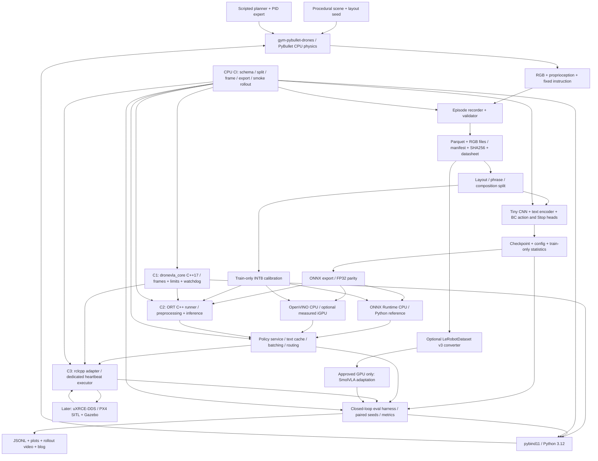

# DroneVLA 로드맵 v3

> **C++ 추가 (2026-10-04, 사용자 결정):** robotics SDE 지원을 위한 실제 C++ 산출물 C1(core+bindings)·C2(ORT runner)를 필수로 추가하고, Phase 5 실행 시 C3(rclcpp node)를 필수로 한다. C++ beginner 학습·debug 시간을 별도 배정하여 기본 release +7주, Phase 5 포함 +9주(추정). 주제·선정 점수는 변경하지 않는다.

작성 기준: 2026-10-04. 실행 주체는 사용자이며, 아래의 구현·실험·그림·블로그는 앞으로 직접 만들 산출물이다. 이 문서는 실험 결과 보고서가 아니다. **수량·threshold는 설계 목표**, 시간·용량·비용은 **추정**, 성능 결과는 모두 **측정 후 기입**으로 구분한다. 주당 10–15시간에는 공부·구현·측정·블로그 작성이 모두 포함된다.

## 0. 요약

**선정 주제: counterfactual instruction pair로 language grounding을 검증하는 CPU 규모의 short-range drone VLA와 deployment pipeline.** 같은 시작 상태·RGB scene에서 “red cylinder로 가서 멈춰라”와 “blue cylinder로 가서 멈춰라”를 각각 실행한다. 작은 RGB+text policy가 실제로 다른 목표로 비행하는지, 새로운 layout·표현·속성 조합에서도 그 차이를 유지하는지 closed-loop로 측정한다. RGB와 text에서 연속 velocity/yaw setpoint 및 Stop을 출력하며, 자세 안정화는 기존 PID controller에 맡긴다.

이 범위를 고른 이유는 drone 문헌의 dense oracle instruction 의존성, prompt 민감성, grounding 문제와 연결되고 [sources.md G1(A7, A10), G9(A10)], GPU 없이도 직접 만든 데이터에서 training → evaluation → ONNX/OpenVINO serving을 완성할 수 있기 때문이다. 기준별 판단 점수는 **96.0/100**, 차선인 **language-conditioned Stop/hover 판단은 94.4/100**이다. 가중치에 따라 순위가 바뀌므로 보편적인 우열로 해석하지 않는다.

완료 산출물은 자체 dataset/generator·datasheet, tiny BC와 paired closed-loop 평가, FP32/INT8 ONNX/OpenVINO serving, CI와 블로그다. **C1 C++17 `dronevla_core`+pybind11·CMake/GoogleTest**, **C2 ORT C++ inference runner와 Python 비교**를 기본 release에 추가한다. Phase 5를 실행하면 **C3 rclcpp/PX4 adapter node**가 Python integration adapter를 대체한다. pretrained VLA/GPU·Isaac·실제 비행은 기본 완료 조건이 아니다.

| Phase | 일정 배정(추정) | 핵심 결과 |
|---|---|---|
| 0 | W1, 1주 | WSL2·renderer·disk 측정, CPU 실행 경로 확정 |
| 1 | W2–5, 4주 | C++ warm-up·C1 최소 core/bindings, CPU thin slice |
| 2 | W6–10, 5주 | C1 watchdog·parity·CI 완성, dataset v0.2 |
| 3 | W11–13, 3주 | grounding·generalization 비교, 실패 분석 |
| 4 | W14–19, 6주 | C2 ORT C++ runner·FP32/INT8 parity·serving·기본 release |
| 5 | W20–24, 5주 | C3 rclcpp 통합·heartbeat/launch tests·SITL gate |
| G1 / G2 | 이후 각각 +2–3주 / +2–4주 | 승인된 경우에만 SmolVLA finetuning / Isaac Sim pilot |

기본 release **12→19주·190–285시간(추정)**, SITL 포함 **15→24주·240–360시간(추정)**. C1은 warm-up 포함 **+4주·40–60시간**, C2 **+3주·30–45시간**, C3 **+2주·20–30시간(모두 추정)**이다. CMake/GoogleTest/pybind11/rclcpp 경험이 없는 Arduino 수준을 가정하며 공부·debug·블로그를 포함한다. Phase 3 이후와 GPU 선택 단계도 뒤로 이동한다. 첫 환경 측정 W1은 유지, 첫 learned closed-loop는 **W3→W5(목표)**로 이동한다. 주10–15시간, 초기 유료 GPU/API 0원은 유지한다. WSLg `D3D12 (Iris Xe)`/`llvmpipe`는 실측 전 미확인이며 CPU TinyRenderer부터 검증한다.

## 1. Landscape

### 1.1 조사 protocol과 근거의 강도

입력 문서(비공개 제약 메모, 블로그 작성 원칙 메모, `sources.md`)를 먼저 읽었다. `sources.md`의 A–F는 139개 행(A15/B12/C29/D29/E30/F24)이며 G는 그 행들의 저자 진술을 주제별로 모은 gap 목록이다. 139개의 서로 독립적인 논문이라는 뜻은 아니다. 조사 원본은 arXiv API, proceedings, GitHub, HF metadata, 공식 docs를 사용했고 A/B에서 215개 unique record와 28개 full text를 검토했다. recall check는 5개 작업을 모두 찾았으나 완전 blind search는 아니었다. 이 한계와 fetched/snippet 구분을 유지한다 [sources.md §0, §10].

v3의 절차는 **hard constraint 확인 → G와 연결되는 후보 생성 → 고정 가중치 점수 → sensitivity → 최소 구현 범위 결정**이다. C/D/E에는 번호가 없으므로 `C: gym-pybullet-drones`, `E: ONNX Runtime`처럼 원본 행 제목으로 인용한다. 저자들의 다른 하드웨어 성능을 이 노트북의 예상 실측치로 옮기지 않는다. 불명확한 venue는 arXiv로 보수적으로 표시하고, license 불명확한 asset은 채택하지 않는다.

문헌 cutoff는 작성 측 해석(April 2026 허용)을 적용하며 사용자 확인 대기 중이다. **arXiv v1이 2026-05-01 이후인 arXiv-only 논문은 제외**, 2026년 4월은 허용하되 arXiv로 표시한다. ID prefix 대신 v1 게시일을 본다. `sources.md §8.2`의 April 후보는 허용되지만 이번 선택의 필수 근거로 추가하지 않았다. 후기 peer-reviewed 문헌은 venue 확인 시 허용한다. SatNav(B11)는 원본의 acceptance 확인 수준을 유지하되 이번 선정의 핵심 근거로 쓰지 않는다. 도구 release는 날짜 제한 대상이 아니며 아래 버전은 2026-10-04 원본 조사값이다. 새 공식 문서 조회도 같은 날짜에 수행했다.

### 1.2 무엇이 이미 있는가

| 범주 | 이미 있는 접근과 근거 | 이번 작업에 주는 판단 |
|---|---|---|
| Drone VLA | CognitiveDrone·RaceVLA는 OpenVLA를 drone action으로 fine-tune하고 Gazebo/ArduPilot 또는 실제 drone을 사용한다. 여기서는 둘 다 arXiv로 취급한다 [A1, A2]. | drone VLA 자체가 비어 있는 분야라는 전제를 버린다. 대규모 backbone 재현은 초기 범위에서 제외한다. |
| Continuous aerial control | AerialVLA(arXiv)는 연속 action과 dual-view를 사용한다. TravelUAV는 waypoint/trajectory, IndoorUAV는 indoor 4-DoF task를 제공한다 [A7, B5, B9]. | 연속 setpoint와 실제 physics step을 사용한다. discrete label만 바꾼 teleport 실험과 구분한다. |
| Small policy와 feature reuse | Flex(arXiv로 보수 표기)는 frozen VLM feature+작은 policy, SINGER(arXiv)는 planner expert와 language-conditioned visual representation, GRaD-Nav++는 CLIP feature+policy를 사용한다 [A8, A9, A12]. | small head라는 설계 방향은 선행 근거가 있으나 이들의 GPU training을 CPU에서 재현한다는 뜻은 아니다. |
| Mission planning·manipulation | UAV-VLA·UAV-CodeAgents는 map 기반 mission planning, AIR-VLA·AirVLA는 aerial manipulation을 다룬다 [A3, A4, A14, A15]. | map planner는 flight policy와 구분한다. manipulation은 task·hardware·data 부담으로 보류한다. |
| Dataset | AerialVLN의 city split, OpenFly의 자동 trajectory/instruction 생성, CityNav의 human demonstration, UAV-Flow의 fine-grained control이 이미 있다 [B1, B2, B4, B7]. | 자체 dataset은 규모 경쟁 대신 paired intervention과 split 재현성에 집중한다. |
| Storage·권리 | HF usedStorage 조사값은 OpenFly 약 2.97 TB, TravelUAV 약 914 GB, UAV-Flow 약 258 GB이며 전체 repo 파일을 포함할 수 있다. 다수 data license가 미확인이다 [B2, B5, B7, §9.1]. | 여유 99 GB인 laptop에 전체 download를 전제하지 않는다. annotation/spec 참고부터 시작한다. |
| CPU simulator | PyBullet DIRECT에는 TinyRenderer camera 경로가 있다. gym-pybullet-drones는 quadrotor controller와 Gymnasium을 제공하고, RotorPy는 CPU physics 및 비사실적 camera를 제공한다 [C: PyBullet note, gym-pybullet-drones, RotorPy]. | 주력은 gym-pybullet-drones+직접 만든 task wrapper. 실패하면 RotorPy camera pilot을 한 번 비교한다. |
| 기타 simulator | Gazebo/PX4는 SITL integration에 적합하지만 WSL GUI issue가 기록되어 있다. Webots는 Intel graphics를 권장하지 않는다. GS-DroneGym의 CPU mock은 실제 scene image가 아니다 [C: Gazebo, PX4, Webots, GS-DroneGym]. | rendering 능력을 이름만으로 판단하지 않는다. mock image를 vision 학습 데이터로 쓰지 않는다. |
| 고비용 simulator | Isaac Sim은 RTX 경로가 필요하다. Pegasus/OmniDrones는 서로 다른 Isaac 버전을 요구한다. AirSim은 업데이트 중단 공지와 archived flag가 일치하지 않으며 Colosseum은 archived다 [C 해당 행 및 conflict note]. | Iris Xe에서 Isaac을 시작하지 않는다. UE·3DGS stack으로 초반 전체를 묶지 않는다. |
| Model/tool | ACT는 기본적으로 language VLA가 아니며, SmolVLA는 pretrained VLA다. LeRobot hardware guide는 CPU training을 권하지 않는다 [D: ACT, SmolVLA, LeRobot facts]. | 초반 모델은 자체 tiny BC. LeRobot dataset integration과 large policy training을 별도 작업으로 분리한다. |
| Deployment | ONNX Runtime의 CPU/INT8, OpenVINO CPU, NNCF가 있다. TensorRT는 NVIDIA용이다. vLLM CPU는 AVX2 제한이 있고 Iris Xe는 문서의 XPU 대상과 동일하지 않다 [E 해당 행]. | GPU 없이 export·PTQ·batching·caching·routing을 먼저 완성한다. vLLM은 선택 실습이다. |
| Evaluation | validation loss와 rollout 성과는 다를 수 있고, unimodal baseline·instruction perturbation에서 shortcut 문제가 관찰된다 [F1, F2, F10–12, F16–18]. | offline MSE를 성공의 증거로 쓰지 않는다. instruction 변경과 layout 분리를 평가 중심에 둔다. |

### 1.3 Gap에서 프로젝트 질문으로

저자의 gap과 이 프로젝트가 실제로 다룰 수 있는 질문을 분리한다.

- **G1/G9:** AerialVLA의 oracle guidance 의존성 지적, SPF의 prompt 민감성·grounding 한계 → 매 step 정답 방향 없이 고정된 goal instruction만으로 target을 구분하는가? 작은 procedural shape에서의 결과이며 open-vocabulary 전체를 대표하지 않는다.
- **G4:** UAV-ON의 termination 한계, Flex의 history 부재 → 도달과 Stop을 구분하는가? short memory가 필요한 조건은 무엇인가?
- **G5/G8:** GRaD-Nav++의 unseen subtask 한계, OpenFly/SINGER의 수집 비용 → 한 사람이 만든 split과 instruction pair로 어떤 조합까지 검사할 수 있는가? 새로운 skill을 이해한다고 주장하지 않는다.
- **G7:** VLA-AN/Flex/SPF의 compute·latency 한계 → 이 CPU policy에서 runtime 변경의 latency 이득과 closed-loop 비용을 함께 측정할 수 있는가? onboard Orin 성능으로 일반화하지 않는다.

## 2. 주제 선정

### 2.1 후보를 보기 전에 고정한 기준과 가중치

Hard gate: drone의 RGB+language→action 경로, 사용자 직접 data 구축, VR 없음, 초기 유료 GPU/API 없음, 실제 비행 전제 없음, 문헌 cutoff 준수. 후보 F는 장기 비교 후보로 두되 원형대로는 CPU gate를 통과하지 못한다. 점수는 측정 성능이 아닌 **설계 판단**이다.

각 항목 1–5점, 높을수록 적합하다. 1은 강한 제약/증거 부족, 3은 축소·추가 구현 후 가능, 5는 기본 범위에서 직접 산출물로 검증 가능이다. 2/4는 중간 판단이다. 총점은 `Σ(weight × score)/5`이며 가중치 합은 100이다.

| 기호 | 기준 | 가중치 | 5점 / 1점의 판단 기준 |
|---|---|---:|---|
| J | JD-competency coverage | 18 | data→train→eval→serve 전 과정 / 단일 demo만 존재 |
| C | CPU·no-paid-GPU 초기 실행 | 18 | 실제 RGB closed-loop+tiny training 가능 / GPU 없으면 핵심 실행 불가 |
| D | 혼자 만드는 no-VR dataset | 12 | scripted expert·검사 자동화 / 전문 pilot·대규모 수동 annotation 필요 |
| E | Closed-loop evaluability | 12 | reset·success·collision 정의와 반복 가능 / offline proxy만 존재 |
| G | Author-stated gap 연결 | 14 | G의 구체 문제를 직접 검사 / 저자 진술 없이 추론만 존재 |
| T | 첫 측정까지 시간 | 10 | 3주 이내 목표 / 핵심 외부 dependency 때문에 시점 불명 |
| H | Interview/hireability signal | 10 | failure analysis·trade-off·재현 artifact를 설명 가능 / 화면 demo에 머묾 |
| R | Risk 관리 가능성 | 6 | 실패를 격리하고 CPU fallback 가능 / 한 blocker가 전체를 중단 |

J는 역량의 **범위**, H는 그 역량을 면접에서 증명하는 **깊이**로 구분한다. 서로 상관되어 있으므로 sensitivity에서도 둘을 별도로 바꾼다. G를 높게 주었다고 gap 해결을 보장하지는 않는다. 초보자의 학습 시간은 T/R에 포함한다.

### 2.2 여섯 후보와 점수

| 후보 | Sub-problem | J | C | D | E | G | T | H | R | /100 |
|---|---|---:|---:|---:|---:|---:|---:|---:|---:|---:|
| A | Counterfactual instruction pair 기반 short-range target navigation의 grounding·generalization | 5 | 5 | 5 | 5 | 4 | 5 | 5 | 4 | **96.0** |
| B | Language-conditioned target 도달 후 Stop/hover 판단과 overshoot 평가 | 4 | 5 | 5 | 5 | 5 | 5 | 4 | 5 | **94.4** |
| C | 반복 구조에서 short memory를 이용한 UAV navigation | 4 | 4 | 4 | 5 | 5 | 3 | 4 | 3 | 82.0 |
| D | Latency-aware action chunking과 asynchronous aerial policy serving | 5 | 3 | 4 | 5 | 5 | 3 | 5 | 3 | 84.0 |
| E | Language policy의 collision recovery·geometric action correction | 4 | 3 | 4 | 5 | 5 | 2 | 4 | 2 | 75.2 |
| F | Photorealistic long-horizon UAV VLA finetuning 및 sim-to-real 지향 평가 | 5 | 1 | 2 | 4 | 4 | 1 | 4 | 1 | 58.4 |

점수의 근거와 감점:

- **A:** G1(A7/A10), G9(A10), G5(A8)에 연결한다. RGB+text BC, paired evaluation, deployment가 하나의 task contract를 공유하므로 J/C/D/E/T/H=5로 판단했다. 다만 counterfactual dataset 설계 자체가 저자의 직접 제안은 아니므로 G=4, toy task에서 language가 불필요해질 위험 때문에 R=4다. F10–12/F16–18은 검증 방법의 근거이지 drone gap의 대용물이 아니다.
- **B:** G4(B6)가 termination을 직접 지적하므로 G=5다. target pair 주변의 짧은 approach/Stop 데이터만 만들면 되어 C/D/E/T/R=5다. navigation planning·representation 학습의 범위가 줄어 J/H=4다. policy가 image·text·motion을 보고 Brake/Continue/Stop을 선택하고 고정 approach controller에 연결되므로 여전히 closed-loop drone VLA sub-problem이다.
- **C:** G4(A7/A12)의 history 한계에 직접 대응한다. history buffer와 recurrent policy는 CPU로 작게 만들 수 있지만 aliasing scene 설계와 실패 원인 분리가 필요해 C/D/J/H=4, T/R=3이다. 전체 경로 memory와 단순 frame stacking의 효과를 혼동할 위험이 있다.
- **D:** G7(A6/A10/A12), E: RTC/SmolVLA async가 근거다. JD 연결은 강하나 이미 기능하는 policy가 먼저 있어야 한다. tiny model에서는 latency 병목이 작을 수 있어 C/T/R=3, data 구성은 가능하되 delay-aware label 검사가 필요해 D=4다. A의 후반 engineering 실험으로 일부 흡수한다.
- **E:** G3(A6/A9/B10), G9(A13)는 분명한 근거다. 그러나 collision-free action과 language goal 보존의 trade-off, physics/frame 검증을 동시에 배워야 해 C=3, T/R=2다. 사용자의 과거 연구와 관계없이 후보에 넣었으며 별도의 safety filter를 핵심으로 선택하지 않았다.
- **F:** G2/G5/G6/G8과 연결되고 JD 범위는 넓다. 하지만 C: Isaac/UE와 A7/B5/D: OpenVLA의 compute 부담, dataset·license 부담으로 C/T/R=1이다. 여러 새로운 변수 때문에 특정 gap을 직접 검사하는 정도도 G/E=4에 그친다. 원형 그대로는 hard gate 탈락이다.

### 2.3 Weight-sensitivity와 판단 불확실성

점수는 고정하고 가중치만 바꿨다. 각 행의 vector 순서는 J/C/D/E/G/T/H/R이며 합은 100이다. 아래 수치는 단순 산술 재계산값이지 실험 결과가 아니다.

| 관점 | 가중치 vector | A | B | C | D | E | F | 1위 |
|---|---|---:|---:|---:|---:|---:|---:|---|
| 기본 | 18/18/12/12/14/10/10/6 | 96.0 | 94.4 | 82.0 | 84.0 | 75.2 | 58.4 | A |
| JD·면접 강조 | 25/15/10/10/10/8/17/5 | 97.0 | 91.6 | 81.4 | 86.8 | 75.8 | 64.2 | A |
| 초기 완주 강조 | 12/25/15/10/10/15/5/8 | 96.4 | 96.6 | 79.4 | 77.8 | 69.8 | 47.6 | B |
| 직접 gap·risk 강조 | 12/12/10/12/25/8/8/13 | 92.4 | 96.0 | 83.2 | 84.8 | 76.6 | 58.6 | B |

A−B는 `(wJ+wH−wG−wR)/5`다. 기본 차이는 1.6점에 불과하다. A의 CPU 점수가 실측 때문에 5→4로 내려가면 A=92.4가 되어 B가 이긴다. 따라서 “안정적인 유일 우승”이 아니라 **production-ML end-to-end 범위를 조금 더 중시한 조건부 선택**이다. Phase 1 종료(수정 일정 W5)의 environment/training profile로 C/T/R 판단 근거를 decision log에 남긴다. 위 점수·가중치는 C++ 추가 전 주제 선정 기록으로 보존한다. T의 3주 기준은 당시 범위이며 C++ 추가 후 달성 일정이라는 뜻이 아니다.

### 2.4 최종 선택, fallback, toy의 경계

**Winner A를 선택한다.** 핵심 질문은 “scene과 시작 상태를 고정한 채 target을 지정하는 language만 바꾸면 연속 flight action과 도착 target이 바뀌는가?”이다. 기본 범위는 한 방, 서로 다른 target 두 개 이상, 짧은 이동, Stop이다. 대규모 language model, 자유로운 도시 탐색, 복잡한 관계 추론을 전제로 하지 않는다. auxiliary control 안정화와 model deployment는 같은 task를 끝까지 실행하기 위한 구성 요소다.

**Runner-up B로 전환할 조건:** Phase 1 종료(W5)까지 RGB closed-loop는 동작하지만 tiny navigation 학습이 한 번의 축소 후에도 시간 budget을 초과하거나, Phase 3 종료(W13)까지 사전 정의한 grounding acceptance를 통과하지 못한 경우. B는 RGB+text-conditioned Stop head와 고정 approach controller의 조합으로 축소한다. 목표 정보가 approach controller에 privileged하게 들어간다는 점을 명시하고, navigation 성능은 B 모델의 성과로 계산하지 않는다. 비교 대상은 거리 기반 oracle Stop, learned no-language Stop, wrong-instruction Stop이다. A의 실패 결과도 삭제하지 않는다. rendering 자체가 불가능하면 B로 바꿔도 해결되지 않으므로 먼저 simulator/CPU renderer fallback을 적용한다.

CPU 버전은 **toy-scale VLA**다. 단순 shape, 작은 vocabulary, 짧은 horizon, simulator proprioception, 기존 PID를 쓴다. pretrained foundation VLA의 능력이나 실제 drone의 sim-to-real을 입증하지 않는다. 그럼에도 counterfactual data 설계, leakage 검사, closed-loop test, 통계, 모델 변환의 수치 검증, latency와 rollout 품질의 trade-off, versioned release는 실제 engineering 산출물이다. 단순 text embedding+CNN이라도 vision와 language가 action을 결정하는 경로는 직접 학습한다. language 효과가 검증되지 않으면 명칭에 상관없이 “grounded policy 확인 실패”로 보고한다.

**선정 완료 기록:** §2.1–2.4와 점수·fallback을 이 파일에 먼저 작성한 뒤에만 상위 폴더의 v2를 읽는다. 이후 비교는 Appendix A에 기록하며 v2를 이유로 위 주제를 바꾸지 않는다.

## 3. System architecture



### 3.1 경계와 version 결정

- **Simulator:** Phase 0에서 `gym-pybullet-drones` main의 실제 commit SHA를 기록한 뒤 고정한다. 오래된 release v1.0.0과 최신 Gymnasium API를 섞지 않는다. reference 환경은 Ubuntu 24.04/Python 3.12이며 PyBullet wheel 부재로 source build가 필요할 수 있다 [sources.md C 해당 행; 추가 확인: [공식 README](https://github.com/learnsyslab/gym-pybullet-drones)]. CPU physics와 TinyRenderer를 기본으로 하고 OpenGL은 측정된 선택 경로다.
- **Policy:** 128×96 RGB, 작은 CNN, train vocabulary 기반 token embedding+mean pooling, proprioception MLP를 concatenate하여 4D continuous action과 Stop logit을 출력한다. 목표 model budget은 **2M parameters 이하(설계 상한)**다. text embedding은 task 시작 때 계산해 cache한다. `target_id`, target 좌표, layout ID, instruction template ID는 policy input에서 제거한다. image history는 Phase 3의 별도 ablation이며 기본 모델에는 넣지 않는다.
- **Train/runtime:** CPU PyTorch FP32를 reference로 하고 ONNX Runtime CPU 및 native OpenVINO CPU를 별도 environment에서 비교한다. 원본 조사값은 torch 2.14.1, ORT 1.30.0, OpenVINO 2026.4.1, NNCF 3.4.0이다 [sources.md E 해당 행]. **동시 호환성은 미검증**이므로 설치 성공과 parity를 확인한 조합만 lock한다. 최신 버전 문자열만으로 compatibility를 주장하지 않는다. ORT OpenVINO EP 1.24.1과 native OpenVINO 최신 release를 임의로 결합하지 않는다 [E: ORT OpenVINO EP].
- **ROS 2:** C++ build를 WSL Ubuntu 24.04에 통일하기 위해 **Jazzy+rclcpp/Gazebo Harmonic/PX4 v1.17/Agent v2.4.3**을 기본 pilot 조합으로 변경한다. Humble의 공식 binary 대상은 Ubuntu22.04, Jazzy는24.04이며 두 distro 모두 rclcpp 예제가 있다 [추가 공식 확인 B.4 CXX05]. 원본 PX4 v1.17 guide의 Humble 권장 사실은 유지하되 [sources.md E: PX4 uXRCE-DDS], 이번 선택은 두 OS/Python toolchain을 동시에 배우는 부담을 줄이기 위한 결정이다. `px4_msgs`는 firmware와 같은 message definitions로 pin한다. 이 전체 조합의 SITL 실행은 미검증이다. Jazzy pilot 실패 시 Phase 5를 보류하거나 별도 일정의 Humble migration ADR을 작성하며, 24.04에 Humble deb를 혼합하지 않는다.
- **Serving:** local function → localhost API → Docker 순서로 감싼다. request는 model/data revision, episode ID, sequence ID, instruction, RGB, state, capture timestamp를 포함한다. response는 action, Stop, observation ID, inference timing이다. 이전 episode의 cache·response·action을 재사용하지 않는다. raw model 결과와 clipped action·watchdog 개입을 모두 기록한다.
- **CI:** lint/schema/unit test부터 시작한다. CPU headless fixed scene smoke, modality input 차단 검사, export parity, service schema, dependency lock 설치를 단계적으로 추가한다. Git에는 code·작은 fixture·manifest를 넣고 큰 image는 넣지 않는다. local Git tag+SHA256 manifest로 시작하고 원격 dataset 업로드는 license/공개 범위 확인 후 수행한다.

### 3.2 C++ 경계·toolchain·한 구현 원칙

**사용자 제안 C1–C3를 채택한다.** core의 실제 소비자는 Python simulator/eval, C++ runner, rclcpp node다. Python은 data·training·experiment orchestration을 맡고 C++로 전체 project를 다시 쓰지 않는다. 초반에는 Eigen을 넣지 않고 `std::array<double,3/4/9>`와 작은 value type으로 vector/quaternion/matrix를 표현한다. fixed-size 변환만 필요한 core에서 dependency·alignment·binding 복잡도를 줄이기 위한 선택이며, quaternion rotation은 analytic fixture와 역변환 test로 검증한다. Eigen 추가는 실제 선형대수 요구가 생길 때 별도 ADR로 결정한다.

| Component | 포함 / 제외 | 호출 경계와 test |
|---|---|---|
| **C1 `dronevla_core`** | ENU↔NED, FLU↔FRD, quaternion(body FLU→world ENU, wxyz 명시) 기반 velocity 회전/역변환, §4.3 action limits, timestamp/sequence validation, watchdog. ROS/Python/ORT dependency 없음 | standalone CMake library와 GoogleTest; pybind11 `_dronevla_core`는 입력 변환만 수행. Python simulator adapter와 eval harness는 이를 필수 호출 |
| **C2 `dronevla_runner`** | CPU ORT C++ API, preprocessing, reusable tensor/session, FP32/INT8 model, stdin/stdout framed IPC 또는 동일 payload의 benchmark CLI | Python ORT reference와 tensor/action parity. Python의 orchestration과 공존하며 action validation은 C1 호출, stateful watchdog 소유자는 아래 runtime 경계로 한정. OpenVINO **C++ API만 선택**, 기존 OpenVINO CPU 실험은 유지 |
| **C3 `dronevla_bridge_cpp`** | rclcpp subscriptions/setpoints, frame conversion·watchdog C1 호출, 독립 heartbeat | C++ node가 Python PX4 adapter를 대체. Python launch/launch_testing은 orchestration/test만 수행하며 flight frame logic을 구현하지 않음 |

**C1 contract:** state를 `WaitingForObservation → Active → Hold`로 제한한다. startup/reset은 Waiting, 같은 episode의 finite·monotonic·fresh observation/action만 Active, age 초과·NaN·잘못된 shape·sequence 역전은 command reject와 Hold다. action expiry는 마지막 유효 command의 observation capture time 기준이다. 거절 packet이 기존 유효 action의 수명을 늘리지 못하게 한다. Hold에서 fresh packet으로 복귀할 조건을 config와 transition test로 고정한다. Stop 요청과 watchdog Hold는 reason enum으로 구분하며 hold pose 선택·PX4 failsafe는 adapter 책임이다. default age limit=400 ms(설계값, 5 Hz의 두 주기), 비교 경계는 `age <= limit`로 명시한다. core는 clock을 직접 읽지 않고 `now_ns`, `capture_ns`, `episode_id`, `sequence_id`를 받는다. simulation-quality mode와 wall-clock mode의 clock domain을 섞으면 reject한다. clip은 수평 norm·vz·yaw cap과 NaN reject를 적용하며 적용 frame·순서도 fixture에 고정한다.

**Runtime 경계:** C2의 response action은 항상 body-FLU m/s·rad/s이며 model raw output도 별도 보존한다. world/PX4 frame 변환은 최종 simulator adapter 또는 C3에서 단 한 번 수행한다. stateful watchdog도 control loop마다 최종 adapter 하나가 소유하고 주기적으로 tick하여 새 packet이 없는 stale 상태를 검출한다. C2는 C1의 stateless validation/clipping을 재사용하되 ROS mode에서 별도의 authoritative watchdog을 중복 운용하지 않는다. standalone runner의 watchdog smoke는 독립 fixture이고 실제 actuator 상태를 대신하지 않는다.

**Parity는 두 층으로 나눈다.** C++ GoogleTest는 수작업 analytic expected values(단위축·90° yaw·norm cap 경계·timeout 경계)와 round-trip/property를 검사한다. Python↔C++ parity는 같은 fixture를 native test CLI와 pybind11로 실행하여 dtype/순서/exception/transition log를 비교하는 boundary test다. 같은 core를 두 번 불렀다는 것만으로 수학적 정확성을 증명했다고 하지 않는다. 테스트 전용 짧은 NumPy reference가 필요하면 `tests/reference/`에만 두며 production Python frame/clipping/watchdog 복사본은 금지한다.

**Toolchain pin 후보 — 공식 web 확인 2026-10-04, 상세 URL은 B.4:**

- Local build는 WSL2 **Ubuntu24.04 x86_64**의 Linux home에서만 한다. CI는 Ubuntu24.04 Linux runner에서 같은 CMake/CTest 명령을 실행한다. native Windows/MSVC build는 범위에서 제외한다. GCC **13 계열**(Ubuntu package 조회 13.3.0), C++17, project `cmake_minimum_required(VERSION 3.22)`를 선택한다. Ubuntu24.04 package의 CMake **3.28.3**을 기준으로 `cmake --version`과 compiler patch를 lock한다. 3.22는 프로젝트 최소 선택이며 ORT 자체 source build의 최소 버전 주장이 아니다 [CXX01].
- GoogleTest **v1.17.0**(C++17 요구)와 pybind11 **3.1.0**을 pin한다. pybind11의 Python3.12 호환 이력과 새 FindPython 모드를 공식 docs에서 확인했다 [CXX02/CXX03]. CPython3.12 standard build를 쓰며 free-threaded Python/subinterpreter는 사용하지 않는다. Python3.12 patch·compiler·pybind version을 build manifest에 기록하고 변경 시 extension을 재build한다.
- CMake는 `find_package(Python 3.12 EXACT COMPONENTS Interpreter Development.Module REQUIRED)`, `PYBIND11_FINDPYTHON=ON`, `find_package(pybind11 CONFIG REQUIRED)`를 사용하도록 설계한다. configure 때 `Python_EXECUTABLE`을 활성 venv의 interpreter로, `pybind11_DIR`을 그 interpreter의 `-m pybind11 --cmakedir` 결과로 지정한다. developer header도 같은 Python minor여야 한다. core static library는 PIC로 build하고 bindings/CLI/ROS가 동일 source target을 link한다.
- ORT C++ CPU package **`onnxruntime-linux-x64-1.30.0.tgz`**가 공식 GitHub release asset에 있는 것을 확인했다 [CXX04]. Python `onnxruntime==1.30.0`과 C++ header/shared library를 같은 release로 pin한다. `ORT_ROOT`의 `include/onnxruntime_cxx_api.h`와 `lib/libonnxruntime.so`를 검사해 CMake imported target을 만든다. `find_package(onnxruntime CONFIG)`가 tarball만으로 자동 동작한다고 가정하지 않는다. archive download·내부 CMake config 파일 유무·이 laptop에서의 link/load는 아직 미검증이다. venv wheel 내부의 `.so`를 임의로 C++ link 대상으로 삼지 않는다. asset hash와 `Ort::GetVersionString()`을 release manifest에 남긴다.
- Release benchmark build와 Debug/ASan/UBSan build directory를 나눈다. GCC에서 `-fsanitize=address,undefined -fno-omit-frame-pointer -g`를 compile/link에 적용하는 sanitizer job은 standalone core/tests부터 시작한다 [CXX06]. ORT prebuilt 내부까지 instrumentation됐다고 주장하지 않는다. sanitizer build로 latency를 측정하지 않는다.

**colcon과 venv 공존:** `~/dronevla/cpp`는 standalone core/bindings/runner build, `~/dronevla_ros_ws`는 Jazzy `ament_cmake` node workspace다. training/bindings shell만 `.venv`를 activate한다. ROS shell은 새 terminal에서 venv/conda를 비활성화하고 `/opt/ros/jazzy/setup.bash`를 source한 뒤 system `/usr/bin/python3`와 apt colcon을 사용한다. configure log의 Python path를 확인하며, ROS package에는 bindings와 ORT runner build를 끄고 같은 core SHA를 별도 prefix에 build/install해 `find_package(dronevla_core CONFIG REQUIRED)`로 소비한다. core source를 복사해 fork하지 않는다. 모든 `.so`·build/install/log directory는 OS/ABI별로 분리하고 training venv의 `PYTHONPATH`/site-packages를 ROS에 주입하지 않는다. `ament_cmake_gtest`는 ROS distro의 test dependency를 사용하고 standalone GoogleTest copy와 같은 test executable에 이중 link하지 않는다.

**CI gate:** clean checkout에서 CMake configure/build→CTest→pybind import/parity→CPU rollout을 필수로 한다. Debug sanitizer job과 Release parity job을 나누며 C2 추가 시 ORT asset/version/load·tensor parity, C3 추가 시 `colcon test`/`launch_testing`을 추가한다. production core 코드에 동일한 transform/watchdog가 중복됐는지 review checklist로 확인한다.

## 4. Dataset spec — 사용자가 직접 구축, no VR

### 4.1 Task와 scene generator

작업 이름은 `DroneTargetPairs`로 한다. 생성자는 **8×8×3 m room(설계값)** 안에 red/blue/green/yellow의 box/cylinder target과 distractor를 배치한다. target 두 개가 각각 유일한 color–shape description을 갖도록 검사한다. 각 target의 collision geometry 바깥에 접근 goal을 둔다. 예를 들어 target 앞 0.75 m의 hover point를 evaluator/expert 전용 metadata로 저장한다. 성공 반경이 target mesh와 겹치면 layout을 reject한다.

Phase 1은 장애물 없는 두 target, 고도 1 m·yaw 고정의 planar 이동이다. action schema는 계속 4D지만 이 단계에서 `vz/yaw_rate=0`임을 기록한다. Phase 2에서는 목표 고도 1.0/1.8 m, yaw 변화, 정적 box 장애물을 순서대로 도입한다. 각 추가 조건은 expert feasibility 검사 후 넣는다. 고도/yaw 변화가 없으면 “full 4-DoF 학습”으로 쓰지 않는다.

`layout_id`는 geometry·object pose·target 속성·obstacle 배치를 canonical JSON으로 정렬한 뒤 hash한다. color/texture만 바꾼 같은 geometry family는 같은 split에 묶는다. 이동·회전·좌우 반전으로 복제한 구조도 parent family ID를 공유한다. seed만 달리한 것을 새 layout으로 세지 않는다. object 좌우 위치와 target label은 균형 있게 배치한다. test 목표를 특정 색상, file index 또는 시작 yaw로 추측하지 못하게 한다.

### 4.2 Expert와 instruction

1. 사용자는 먼저 target hover point까지 직선 waypoint+기존 velocity/PID controller를 구현하고 실제 physics rollout을 본다. 장애물을 넣은 뒤에는 inflated occupancy grid의 A* waypoint를 사용한다. altitude별 연결과 collision clearance를 검사한다. 이는 privileged map/target 좌표를 쓰는 **oracle expert**다.
2. expert도 teleport하지 않는다. policy와 같은 rate·velocity cap·physics·collision 판정을 사용한다. teacher action은 실제 controller에 넣은 setpoint이고 다음 frame은 실제 simulation step 이후의 관측이다. expert trajectory가 실패하면 training에서 제외하되 rejected manifest에는 이유를 남긴다. 생성 전 feasibility가 확인된 test scenario는 policy 실패를 이유로 삭제하지 않는다.
3. keyboard/gamepad는 선택적으로 실패 상황 확인·소규모 corrective demonstration에만 사용한다. 원격/VR은 필요 없다. teleop rate·operator ID·입력 smoothing을 기록하여 planner dataset과 섞인 비율을 알 수 있게 한다.
4. scene의 semantic goal에서 instruction을 생성한다. 기본은 “Go to the red cylinder and stop.” 같은 English instruction이다. 한국어 블로그와 policy language는 별개다. LLM/API 사용 없이 사람이 작성한 paraphrase family를 사용한다. 목표·경로 caption·expert action을 구별하고 매 step 정답 turn hint를 주지 않는다 [sources.md G1(A7)].
5. 같은 initial simulator snapshot에서 두 instruction을 각각 rollout하는 `pair_id`를 만든다. pair A/B의 첫 RGB와 proprioception이 같고, 목표와 expert action sequence는 달라야 한다. 한쪽을 mirror image로 바꾸면 counterfactual language-only pair가 아니므로 금지한다.
6. paraphrase는 문장 exact match가 아니라 문법 family로 split한다. 예를 들어 train에 “Go to … and stop”과 “Approach …, then hold position”을 두고, I suite에는 “Go to …, then hold position”처럼 **단어는 학습했지만 결합 방식은 다른 family**를 둔다. 서로 다른 target을 넣은 같은 grammar를 새 family로 세지 않는다. 미학습 synonym을 넣는 실험은 600-episode main test 밖의 별도 OOV diagnostic이며 compositional generalization으로 포장하지 않는다. train-only tokenizer에 `<unk>`를 두고 OOV 비율을 보고한다.
7. target color와 shape 각각은 train에 나타나되 일부 **color×shape 결합**을 held out한다. 이는 unseen skill이 아니라 seen concept의 recombination이다. 사람이 무작위 50개 pair(설계 표본)를 확인하고 ambiguous instruction·wrong target를 수정한 뒤 version을 올린다.

### 4.3 Observation/action contract

| 항목 | 고정할 계약 |
|---|---|
| Vision | front RGB uint8, H=96/W=128/C=3, camera intrinsics/extrinsics와 FOV를 manifest에 기록. RGB order 고정; alpha 제거. goal marker/segmentation은 policy input에 없음 |
| Proprioception | body-FLU velocity 3, roll/pitch 2, yaw sin/cos 2, angular velocity 3, altitude 1: 총 11 float32. sim state임을 표시. absolute XY·goal distance 제외 |
| Language | episode 내 고정 instruction, train vocabulary/tokenizer revision, max token length 32(설계). truncation은 검출 후 reject |
| Action | `(vx_body, vy_body, vz_body, yaw_rate)` float32 + Stop logit. FLU의 x forward/y left/z up, m/s·rad/s. 수평 vector norm ≤0.5 m/s, 수직 ≤0.3 m/s, yaw rate ≤0.5 rad/s(설계 cap) |
| Rate | physics 240 Hz, PID/controller 60 Hz, RGB/label/policy 5 Hz(설계값). physics 48 step당 policy 1회. rate 실제 적용 여부를 timestamp로 검증 |
| Stop | validation에서 threshold 고정 후 3회 연속 양성이면 terminal 요청. 요청 시 현재 pose hold controller로 전환하고 1 sim-second 확인. 잘못 멈춘 episode도 실패로 종료 |
| Termination | correct target 반경 0.4 m, 속도 norm ≤0.1 m/s를 Stop 후 1 sim-second 유지하며 collision 없음이면 성공. timeout 30 sim-seconds. out-of-bounds/collision은 실패 종료(모두 설계값) |
| Data alignment | `obs_t` 직후 `action_t` 적용, `obs_t+1`은 0.2 sim-second 뒤. 마지막 terminal obs와 action mask 구분. simulation time·monotonic wall time을 둘 다 저장 |

C1의 `core_git_sha`, `action_contract_version`, cap/watchdog config hash, frame convention과 clock domain을 dataset·rollout manifest에 추가한다. clamp 전 policy output과 C1이 적용한 action, reject/hold reason을 구분해 기록한다. contract 변경으로 같은 input의 label/action 의미가 바뀌면 dataset/model compatibility version도 올린다.

학습 정규화 통계는 train에서만 계산한다. action cap에 따른 고정 scaling과 train state mean/std를 checkpoint에 저장한다. camera motion과 Stop threshold는 validation에서만 조정한다. 위 값은 물리적 안전 인증값이 아니라 작은 simulator task의 정의다.

### 4.4 Episode 수·GB·생성 시간

**아래는 모두 추정이며 이 laptop에서 측정하지 않았다.** 계산 가정: episode 평균 20 sim-seconds, 5 RGB/s, 100 frame/episode, 128×96×3 uint8, worker 1개, CPU physics+render+record 총 처리량 **5–20 recorded frames/wall-second라는 계획용 가정**, reset/planning/reject/encoding 비용으로 계산 시간에 1.5배. thermal throttling·compile·수동 QA·학습 시간은 제외한다. Phase 0의 1000-frame profile로 가정을 교체한다. JPEG 평균 6–15 KB/frame은 압축률 가정이며 artifact가 심하면 PNG/높은 품질을 다시 측정한다. GB는 10^9 bytes다.

| 단계 | Episode 계획 | Frame 추정 | Raw RGB 추정 | 저장 추정(RGB+metadata) | 1회 생성 추정 |
|---|---:|---:|---:|---:|---:|
| v0.1 thin slice | 80 = train 40 + val 20 + smoke test 20 | 8,000 | 0.295 GB | 0.06–0.15 GB | 10–40분 |
| v0.2 training | 1,200 | 120,000 | 4.424 GB | 0.84–2.04 GB | 2.5–10시간 |
| v0.2 validation | 200 | 20,000 | 0.737 GB | 0.14–0.34 GB | 0.42–1.67시간 |
| v0.2 test reference | 600 | 60,000 | 2.212 GB | 0.42–1.02 GB | 1.25–5시간 |
| v0.2 합계 | 2,000 | 200,000 | 7.373 GB | **1.4–3.4 GB** | **4.2–16.7시간** |

Raw 계산은 `N×100×128×96×3/1e9`, 시간은 `N×100/fps/3600×1.5`다. v0.1 표에는 작은-file metadata 여유를 추가했다. v0.2 metadata는 frame당 1–2 KB 수준의 저장 overhead를 가정했다. test reference는 expert 품질 확인용이며 train loader 접근을 막는다. policy 평가 영상은 별도이므로 이 용량에 포함하지 않는다. 모든 rollout RGB를 영구 저장하지 않고 metrics/state와 미리 정한 대표 episode만 영상화한다.

disk budget은 **상한 배정**으로 OS/WSL·packages/build 25 GB, dataset·변환 staging 20 GB, checkpoint·cache 10 GB, log/video 10 GB, 여유 34 GB를 둔다(합 99 GB). 이미 설치된 WSL/Docker가 쓰는 실제 공간을 Phase 0에서 차감한다. 여유가 30 GB 아래면 새 대량 생성·cloud download를 중단한다. VHDX 내부 파일 삭제가 C: 공간 반환과 같다고 가정하지 않는다. full public dataset은 받지 않는다.

생성은 resume 가능한 shard 단위로 사용자 직접 실행하고 중간 실패를 manifest에 남긴다. 먼저 20 episode pilot을 만든 뒤 성공/reject 비율·bytes/frame·wall time을 측정하여 수량과 시간을 재계산한다. 부족하면 600 train/100 val/300 test로 축소할 수 있으나 pair/family 분리는 그대로 지킨다. version과 평가 표본수를 함께 바꾼다.

### 4.5 Split·versioning·datasheet

v0.2는 train 60 layout families×20 episode=1,200, validation 10 새 families×20=200으로 설계한다. 각 family에 10 counterfactual pairs가 있다. test 600은 아래 세 suite로 분리한다. test의 instruction/expert action은 학습 중 열지 않는다.

| Suite | 200 episode 구성(각 100 pair) | 무엇을 검사하는가 |
|---|---|---|
| L: layout-only | train/val과 disjoint인 10 layout families, train phrase/concept 조합 | 새로운 geometry에서 grounding |
| I: instruction-only | train의 10 families를 재사용하되 reserved start snapshots, held-out phrase families | geometry를 고정한 표현 변화. **unseen-layout 결과가 아니다** |
| C: held-out composition | L/val/train과 다른 10 families, train에 없는 color×shape 결합, train phrase family | layout+concept composition 공동 변화. 단독 composition 인과 효과로 해석하지 않음 |

train/validation/test 간 공통 `pair_id`, snapshot hash, canonical geometry family, phrase family를 목적에 맞게 검사한다. I의 의도적 geometry 재사용만 allowlist로 허용한다. train에 없는 color/shape token을 C에 넣지 않는다. color-position contingency table과 image near-duplicate report를 함께 낸다. 동일 pair의 두 episode와 같은 episode의 모든 frame은 항상 같은 split이다.

원본 저장은 **project schema v0.x**이며, `episodes.parquet`(episode/pair/layout/instruction/split/seed), `steps/*.parquet`(time/state/action/flags/image path), `rgb/`, `layouts/*.json`, `manifest.json`, `splits.json`, `datasheet.md`를 둔다. JSON manifest는 code SHA·config hash·file SHA256·camera/controller version·license를 연결한다. 본래 형식을 LeRobot v3라고 부르지 않는다.

G1 이전에 LeRobot 0.6.1의 `LeRobotDataset` API로 변환하고 `codebase_version=v3.0`, episode offset·task index·video timestamp를 loader로 round-trip 확인한다. v3는 여러 episode가 한 Parquet/MP4에 들어가며 boundary가 metadata로 결정된다. docs와 code의 tasks path 불일치가 있으므로 hand-written folder 흉내 대신 고정 release API를 따른다 [sources.md D: LeRobot facts].

datasheet 필수 항목: 목적/제외 용도, 생성자·날짜, scene 범위, expert의 privileged input, 관측 가능한 것과 GT label의 구분, instruction grammar·OOV, split 규칙, 성공/실패·reject 사유, label alignment, control rate·frame convention, 개인정보 포함 여부, 각 asset/code/data license, known bias, storage/time 실측, 재생성 command, semantic version·변경 내역. version을 덮어쓰지 않고 generator 수정 시 data revision을 올린다. 자작 geometry를 기본으로 하며 license 미확인 공개 data/weights는 재배포하지 않는다.

## 5. Phases — 사용자가 직접 실행하고 이해하는 순서

이 절의 `python -m dronevla...`, `scripts/...`, config, report 경로는 **앞으로 사용자가 구현할 CLI 계약**이다. 현재 존재하거나 실행 검증된 코드가 아니다. 각 단계에서 작은 함수 구현 → 예제 한 번 실행 → log 읽기 → 자동화 순서로 진행한다. 설치 명령과 자체 CLI를 구분한다. 주간 시간은 공부 약 25%, 구현 45%, 측정·정리 15%, 블로그 15%로 배정하는 **추정**이며 다른 일정에 따라 scope를 줄인다.

C++ 추가분은 기존 시간에 숨기지 않는다. **C1 +40–60시간(추정)**은 Phase 1 +20–30시간, Phase 2 +20–30시간으로 나눈다. 그 안에 warm-up 8–12시간(추정)을 포함한다. **C2 +30–45시간**, **C3 +20–30시간(추정)**을 각각 Phase 4/5에 더한다. 가정은 작은 core, 외부 C++ framework 추가 없음, ROS Jazzy 한 distro, 기존 data/eval 재사용이다. segfault·ABI 문제가 이 범위를 넘으면 actual time과 새로운 완료 주를 기록한다. C1/C2를 건너뛴 release를 C++ 완료로 표시하지 않는다.

### Phase 0. 환경과 측정 경로 확정 — W1, 1주(10–15시간 추정)

**목표:** 사용자가 WSL·Python·renderer·파일 위치를 설명하고, 실제 camera frame이 생성되는 CPU 실행 경로를 하나 확보한다.

**직접 할 일**

1. 지금 진행 중인 WSL 설치를 중복 실행하지 않는다. 설치 완료·재부팅 후 PowerShell에서 `wsl --status`, `wsl --version`, `wsl -l -v`를 실행해 version/distro를 기록한다. Linux prompt가 열리기 전까지 WSL 설치 완료로 판정하지 않는다. GUI는 WSL2와 host GPU driver를 전제로 한다 [추가 공식 근거: [Microsoft WSL GUI](https://learn.microsoft.com/en-us/windows/wsl/tutorials/gui-apps)].
2. Windows OneDrive workspace와 별개로 **Linux home의 ASCII 경로 `~/dronevla`**에 실행 repo를 사용한다. 기존 파일을 무단 이동·삭제하지 않고 source만 복사/clone한다. 대형 data·build·venv는 OneDrive 밖에 둔다. 이 로드맵 작성 자체는 현재 directory의 Markdown만 변경한다.
3. Ubuntu에서 `uname -a`, `lsb_release -a`, `free -h`, `df -h`, `lscpu`를 기록한다. Python venv 또는 conda 환경 하나를 만들고 CPU torch·PyBullet을 설치한다. repo README의 Python/build dependency를 읽고 `build-essential`이 필요한지 확인한다. 동시에 여러 source build를 돌리지 않는다.
4. `sudo apt update`, `sudo apt install mesa-utils` 후 `glxinfo -B` 전체 출력을 저장한다. GUI OpenGL 선택은 [WSLg GPU selection](https://github.com/microsoft/wslg/wiki/GPU-selection-in-WSLg)을 참고한다. renderer 문자열, GL version, driver, 실행 shell을 log에 남긴다. 환경 변수로 renderer를 강제하기 전후 출력을 따로 남긴다.
5. PyBullet `DIRECT`와 `getCameraImage(..., renderer=ER_TINY_RENDERER)`로 두 색상 object를 실제 렌더링한다. image 저장 후 직접 확인한다. pixel 변화·frame checksum만으로 scene가 맞는지 확인했다고 끝내지 않는다. 공식 PID 예제를 읽고 1 drone hover와 velocity step response를 plot한다 [sources.md C: PyBullet note/gym-pybullet-drones].
6. 구현할 `python -m dronevla.profile_env --frames 1000 --renderer tiny --out reports/env.json`으로 reset/physics/render/encode별 wall time, peak RSS, bytes/frame을 측정한다. 배터리 대신 AC 전원, 고정 power mode, background app 상태를 기록한다. memory 사용이 WSL에 배정한 상한에 접근하면 worker 1·작은 batch를 유지한다.

**Renderer branch**

| 실측 결과 | 다음 행동 | 통과하지 못하면 |
|---|---|---|
| `D3D12 (Intel Iris Xe...)` | hardware-backed OpenGL 후보로 기록. 같은 scene의 TinyRenderer와 OpenGL image/FPS/RSS를 비교. Gazebo는 Phase 5에서 별도 확인 | D3D12만 보고 Gazebo·OpenVINO GPU 가능 판정 금지. artifact/crash 시 TinyRenderer 고정 |
| `llvmpipe` | software OpenGL임을 기록. PyBullet DIRECT+TinyRenderer로 진행. GUI는 필요할 때만; recording 128×96·5 Hz 유지 | 느리면 64×48과 2 Hz 별도 data revision으로 축소하고 시간 추정 재산출 |
| GL context 실패/다른 renderer | raw log를 보존하고 TinyRenderer를 먼저 테스트. D3D12/llvmpipe 어느 쪽으로도 추정하지 않음 | CPU rendering 실패까지 이어지면 RotorPy 비사실적 camera pilot. 둘 다 실패하면 WSL 복구를 blocker로 보고 |

OpenGL renderer와 OpenVINO compute device는 서로 다른 확인 대상이다. `D3D12`라고 PyTorch XPU training을 켜지 않는다. sources.md E: PyTorch XPU의 공식 대상에는 이 Iris Xe가 명시되어 있지 않다.

**배울 것·공식 docs:** [WSL 설치](https://learn.microsoft.com/en-us/windows/wsl/install), [Linux filesystem 작업](https://learn.microsoft.com/en-us/windows/wsl/filesystems), [Python venv](https://docs.python.org/3/library/venv.html), [gym-pybullet-drones README/예제](https://github.com/learnsyslab/gym-pybullet-drones), [PyBullet 공식 repo](https://github.com/bulletphysics/bullet3/tree/master/examples/pybullet). renderer와 physics의 차이, process/env, Git commit pin을 직접 설명해 본다.

**산출물:** `environment.md`, dependency lock, renderer raw log, 두 target RGB, hover/step plot, `reports/env.json`, 최소 CI.

**Exit 기준(설계):** 실제 RGB 1000 frame 기록 완료; NaN/state time 역행 없음; renderer 이름과 peak RSS/FPS를 빈칸 없이 기록; 한 command로 headless 실행 가능; clone 위치가 OneDrive 밖. 예상 전체 생성이 2회 야간 실행 범위를 넘으면 resolution/episode 수를 줄인다. install/renderer troubleshooting은 6시간 상한 후 fallback으로 이동한다.

**JD:** 재현 환경·profiling·CI·문서화. **블로그:** P01 환경 분기와 첫 RGB.

### Phase 1. C++ warm-up·C1 시작·CPU thin slice — W2–5, 4주(40–60시간 추정)

**목표:** 작은 자체 data로 training → service → closed-loop까지 사용자 손으로 한 번 연결한다.

**C1 이전 warm-up — 8–12시간 추정, 위 일정에 포함**

1. WSL Ubuntu24.04에서 `g++ --version`, `cmake --version`을 기록하고 `cpp/warmup`에 작은 `clamp_velocity` 함수, header/source, CLI `main()`을 직접 작성한다. `struct`, `enum class`, `std::array`, `const&`, value lifetime, RAII, namespace를 이 예제로 배운다. 메모리 소유는 value/standard container로 제한하고 raw `new/delete`를 쓰지 않는다.
2. [CMake tutorial](https://cmake.org/cmake/help/v3.28/guide/tutorial/index.html)의 target/include/link 개념으로 library와 executable을 나눠 build한다. [GoogleTest primer](https://google.github.io/googletest/primer.html)를 따라 zero/경계/초과 입력 test를 쓰고, 의도적으로 틀린 expected value로 실패한 뒤 수정한다. `ctest --output-on-failure`에서 test가 0개인 것도 실패로 검사한다.
3. Debug build를 [ASan/UBSan](https://gcc.gnu.org/onlinedocs/gcc-13.3.0/gcc/Instrumentation-Options.html)으로 실행한다. warm-up 전용 잘못된 lifetime 예제의 진단을 읽고 고친다. 이것은 실제 프로젝트 incident가 아니라 학습용 fault injection이다. sanitizer가 모든 memory/thread bug를 찾는다고 해석하지 않는다.
4. [pybind11 first steps](https://pybind11.readthedocs.io/en/stable/basics.html)로 함수 하나를 Python에서 호출한다. interpreter·extension path를 출력하고 같은 fixture를 CLI/Python으로 비교한다. **warm-up exit:** clean build→의도적 실패→수정→CTest pass와 import 성공을 본인이 설명한다. warm-up 함수를 production Python/C++ 양쪽에 복제하지 않고 이후 C1 target으로 정리한다.

**직접 할 일**

0. warm-up 뒤 `dronevla_core` C++17 target과 pybind11 module을 만든다. ENU/NED·FLU/FRD·body/world 변환, action cap, startup/fresh/stale의 최소 watchdog을 §3.2 contract대로 구현한다. analytic fixture와 binding parity를 먼저 통과시킨 뒤 아래 Python environment의 action adapter/eval에서 호출한다. raw output·clipped output·watchdog reason을 모두 기록한다. C++ library가 존재만 하고 Python loop에서 사용되지 않는 상태를 완료로 세지 않는다.

1. [Gymnasium custom environment](https://gymnasium.farama.org/introduction/create_custom_env/)의 `reset/step/terminated/truncated`를 공부하고 wrapper를 작성한다. control 없이 RGB 한 장을 보고 action을 수동 지정해 기체 이동을 확인한다.
2. 두 target의 hover point와 성공/충돌/timeout 판정을 만든다. fixture에서 정답 target 도착·오답 target 도착·접촉·timeout을 각각 고의로 발생시켜 evaluator를 확인한다.
3. 80 episode v0.1을 만든다. family 단위 train40/val20/test20, 각 split에서 paired instruction을 보장한다. metadata/image/action alignment를 3개 episode에서 수동 확인한다.
4. ≤2M parameter CNN+text BC를 CPU FP32로 학습한다. motion에 Huber loss, Stop에 BCE를 사용하고 class imbalance weight는 train에서만 정한다. 먼저 한 pair를 overfit하여 학습 경로를 debug한다. 그 결과를 generalization으로 보고하지 않는다.
5. 100 minibatch pilot에서 step time/RSS를 재고 총 training 시간을 extrapolate한다. batch16·worker0에서 시작한다(설계값). 1회 run 예상이 2시간을 넘으면 64×48·채널 수 축소를 한 번 적용한다. LeRobot의 큰 ACT/SmolVLA CPU training을 대신 시도하지 않는다 [D: LeRobot hardware guide].
6. scripted expert, no-language BC, text BC를 같은 closed-loop API로 실행한다. 처음은 in-process, 다음은 localhost service로 연결한다. action MSE·SR·wrong-target·latency를 수치 그대로 기록하고 paired rollout 영상 한 쌍을 만든다.

**배울 것·공식 docs:** [PyTorch basics](https://docs.pytorch.org/tutorials/beginner/basics/intro.html)의 Dataset/DataLoader/autograd/train loop, [Gymnasium](https://gymnasium.farama.org/), [Python time](https://docs.python.org/3/library/time.html), [Docker Get started](https://docs.docker.com/get-started/). policy rate와 PID rate가 왜 다른지 diagram으로 설명한다.

**C++ 학습:** [CMake tutorial](https://cmake.org/cmake/help/v3.28/guide/tutorial/index.html), [GoogleTest primer](https://google.github.io/googletest/primer.html), [pybind11 build systems](https://pybind11.readthedocs.io/en/stable/compiling.html), [C++ Core Guidelines](https://isocpp.github.io/CppCoreGuidelines/CppCoreGuidelines). compiler error와 linker error, Python import error를 구분하고 include/link/runtime-load 경로를 그려 본다.

**산출물:** dataset v0.1, schema validator, tiny checkpoints, `python -m dronevla.pipeline --config configs/thin_slice.yaml`, 20 smoke rollout JSONL, local service.

**C1 초기 산출물/exit:** `cpp/core/{include,src,tests}`, CMake target, `_dronevla_core`, analytic golden fixtures, Python parity test, CI workflow. CTest와 pybind import/parity가 clean Ubuntu24.04 checkout에서 통과하고 CPU smoke trace에 core version·실제 호출이 남아야 Phase 1 C++ gate를 통과한다. Python wrapper와 native CLI의 frame 출력 차이≤1e-9(double fixture), state/reason/sequence는 exact match를 설계 gate로 둔다. 측정 결과가 아니다.

**Exit 기준(설계):** fixed 20 test rollout을 세 baseline이 모두 실행하고 결과/실패 사유 저장; instruction와 RGB가 API를 통과; invalid timestamp/action shape를 reject; evaluator의 성공/오답/충돌 fixture 통과. 높은 SR은 이 단계 exit 조건이 아니다. 2시간 training budget을 한 번 축소 후에도 넘으면 §2.4 B 전환을 기록한다.

**JD:** data→train→eval→serve, C++17·CMake·GoogleTest·pybind11, API 계약, profiling. **블로그:** P02 작은 model의 closed-loop와 toy 경계, P10 C++ core 글의 warm-up/설계 초안.

### Phase 2. C1 완성·사용자 dataset과 누수 차단 — W6–10, 5주(50–75시간 추정)

**목표:** 데이터가 목표·language 관계를 학습하도록 구성됐는지 사용자 자신이 검사할 수 있게 한다.

**직접 할 일**

1. Phase 1의 고정 scene를 procedural layout generator로 바꾼다. color-position 균형, target description의 유일성, 접근 hover volume의 충돌 여부를 검사한다.
2. 기존 PID tracking을 먼저 확인한 뒤 obstacle과 A* expert, altitude/yaw 변화를 하나씩 넣는다. obstacle complexity를 올려 expert부터 실패하는 scene는 초기 task에서 뺀다. 삭제 규칙은 data 생성 전에 고정한다.
3. §4.5의 family/phrase/composition split을 **render 이전**에 만든다. held-out vocabulary/OOV를 검사한다. 같은 pair 첫 RGB 동일성, 목표별 label 차이를 확인한다.
4. 20 episode pilot으로 GB·생성 시간 추정을 교체한다. 2,000 episode 계획은 disk/time cap 안에서 shard별 생성한다. 사용자가 밤에 batch를 시작·종료하고 reject report를 읽는다. offline image cache는 train에만 생성한다.
5. normalization leakage, action alignment, duplicate/family leakage를 validator로 막는다. 자작 object asset의 license와 data 공개 범위를 datasheet에 기록한다. 추후 LeRobot 변환용 field mapping을 문서화한다.

6. **C1 완성:** quaternion convention/invalid norm/회전 역변환, 수평 norm clipping, NaN/Inf, timestamp 역행·future observation·age 경계, episode reset, sequence 역전, Hold→Active 복귀를 parameterized GoogleTest와 pybind parity fixture에 넣는다. watchdog은 fake clock으로 test하여 실제 sleep에 의존하지 않는다. Python simulator와 eval harness에 남은 production frame/clipping/watchdog 함수를 제거하고 binding만 호출하게 한다.
7. standalone core의 CMake install/export target을 만들어 후반 ROS가 재사용할 수 있게 한다. Release와 sanitizer build의 CTest, Python3.12 parity, 실제 adapter rollout을 CI에 넣는다. fixture 기대값·test 수·core SHA를 report로 저장하며 초기 implementation을 복사한 test만으로 채우지 않는다.

**배울 것·공식 docs:** [Apache Arrow/Parquet](https://arrow.apache.org/docs/python/parquet.html), [LeRobotDataset v3](https://huggingface.co/docs/lerobot/lerobot-dataset-v3), [Git tagging](https://git-scm.com/book/en/v2/Git-Basics-Tagging), [Gymnasium seeding](https://gymnasium.farama.org/api/utils/). train statistic과 test information이 섞이는 사례를 작은 예제로 직접 재현한다.

**산출물:** dataset v0.2, datasheet, split manifest, expert quality/reject report, instruction catalog, `python -m dronevla.data.build --config configs/data_v02.yaml`.

**C1 추가 학습/산출물:** [CTest](https://cmake.org/cmake/help/v3.28/manual/ctest.1.html), [CMake packaging](https://cmake.org/cmake/help/v3.28/guide/importing-exporting/index.html), [pybind11 exceptions](https://pybind11.readthedocs.io/en/stable/advanced/exceptions.html). `dronevla_coreConfig.cmake`, API contract, watchdog transition diagram, fixture corpus, `reports/core_parity.csv`를 남긴다.

**C1 최종 exit(필수):** CTest pass·test 수>0, ASan/UBSan standalone test diagnostic 없음, Python↔C++ parity 전 fixture 통과, simulator/eval 양쪽이 같은 core SHA 사용, clean checkout CI green. core가 반환한 reject/hold 사유를 rollout에서 확인하고 production Python 복사본 없음. library build만 통과하고 binding이 사용되지 않으면 완료 아님.

예정 재현 명령(WSL Bash, 사용자가 CMake options와 targets를 구현한 뒤 실행):

```bash
cmake -S cpp -B build/cpp-release -DCMAKE_BUILD_TYPE=Release -DDRONEVLA_BUILD_BINDINGS=ON -DPYBIND11_FINDPYTHON=ON -DPython_EXECUTABLE="$VIRTUAL_ENV/bin/python" -Dpybind11_DIR="$(python -m pybind11 --cmakedir)"
cmake --build build/cpp-release --parallel 2
ctest --test-dir build/cpp-release --output-on-failure --no-tests=error
PYTHONPATH="$PWD/build/cpp-release/python" python -m pytest tests/test_core_parity.py
# standalone core/test sanitizer build: Python/ORT는 이 job에서 제외
cmake -S cpp -B build/core-sanitize -DCMAKE_BUILD_TYPE=Debug -DDRONEVLA_BUILD_BINDINGS=OFF -DDRONEVLA_BUILD_ORT_RUNNER=OFF -DDRONEVLA_ENABLE_SANITIZERS=ON
cmake --build build/core-sanitize --parallel 2
ctest --test-dir build/core-sanitize --output-on-failure --no-tests=error
```

별도 `build/cpp-sanitize`에서 `DRONEVLA_SANITIZERS=ON`, bindings=OFF로 core/tests를 먼저 검증한다. pybind까지 sanitizer를 확장할 때 host Python과 ASan runtime load 순서를 확인한다. 진단용 설정을 Release benchmark에 가져오지 않는다.

**Exit 기준(설계):** 의도한 I suite allowlist 외 family 교집합 없음; pair/snapshot leakage 0; 모든 action timestamp aligned; ambiguous instruction 0; 수동 50 pair audit 기록; feasibility fixture 전부 통과. 생성 pilot에서 expert 성공이 95% 미만이면 scene/controller를 수정하고 data revision을 올린다. 이 95%는 목표 gate이며 실측 결과가 아니다.

**JD:** 수집·정제·versioning·data quality, reusable C++ library·boundary testing·CI. **블로그:** P03 counterfactual dataset과 template leakage, P10 C1 부분 발행(ROS 부분은 Phase 5 후 업데이트).

### Phase 3. Grounding과 generalization 검증 — W11–13, 3주(30–45시간 추정)

**목표:** 성능 표를 만드는 데서 끝내지 않고 language 효과와 실패 원인을 분리한다.

**직접 할 일**

1. §7의 metric/split/seed/성공 rule을 YAML로 고정한다. test를 열기 전에 model 선택 기준을 validation closed-loop SR, 동률이면 wrong-target·latency 순으로 정한다. offline loss는 debug에만 사용한다.
2. train seed 3개로 text BC/no-language BC를 학습한다. 하나씩 실행하여 memory를 겹치지 않는다. shuffled instruction과 no-vision을 추가한다. parameter count·step 수·최대 wall budget을 같게 맞춘다.
3. budget 허용 시 train-only synthetic visual task로 CNN을 pretrain한 뒤 BC finetune한다. 이는 **자체 tiny model finetuning**이며 pretrained foundation VLA adaptation과 구분한다. 재학습 없는 baseline도 유지한다.
4. main test L/I/C를 같은 reset snapshot으로 rollout한다. target swap·valid paraphrase·object token masking·blind control을 실행한다. collision/timeout/wrong target/Stop 실패를 분류하고 대표 실패를 고정 규칙으로 골라 영상을 만든다.
5. CPU 학습이나 grounding이 막히면 먼저 single-pair sanity, image channel, label lag, target balance를 점검한다. 한 번의 data/model 수정은 validation에서만 평가한다. test를 보고 수정했다면 새 revision의 test를 만들고 이전 test는 development로 격하한다.

**배울 것·공식/원저자 docs:** [PyTorch reproducibility](https://docs.pytorch.org/docs/stable/notes/randomness.html), [SciPy bootstrap](https://docs.scipy.org/doc/scipy/reference/generated/scipy.stats.bootstrap.html), [rliable](https://github.com/google-research/rliable), [robomimic study](https://robomimic.github.io/study/). CI의 sampling unit이 frame이 아닌 layout/pair인 이유를 설명한다 [sources.md F1/F2/F21/F23, F methodology].

**산출물:** seed별 checkpoints, locked evaluation config, `python -m dronevla.eval --suite all --config configs/eval_v02.yaml`, paired metrics/CI, failure gallery, model card.

**Exit 기준(설계):** 3 seed·세 suite·baseline 표와 CI 완성. “grounding 확인”은 text BC−no-language BC의 paired SR 차이와 text BC−shuffled의 차이에 대해 layout-clustered 95% CI 하한이 모두 0을 넘고, counterfactual pair 양쪽 target 성공률이 no-language보다 높을 때만 허용한다. 부족하면 **미확인**으로 기록하며 효과를 만들기 위해 시험 횟수를 계속 늘리지 않는다. W13에도 충족 못하면 B로 축소하고 실패 분석을 기본 release에 포함한다.

**JD:** model training/finetuning·실험 설계·evaluation·failure analysis. **블로그:** P04 language를 쓰는지 판별하는 실험.

### Phase 4. C2 C++ runner·CPU deployment와 inference optimization — W14–19, 6주(60–90시간 추정)

**목표:** 모델 변환과 최적화가 closed-loop behavior에 미치는 영향을 재현 가능한 artifact로 남긴다.

**직접 할 일**

1. FP32 PyTorch eval mode를 reference로 고정한다. tensor shape와 text preprocessing을 분리하여 고정 길이 token tensor를 받는 model을 ONNX로 export한다. unsupported op가 있으면 CNN/action head부터 분리 export하고 미지원 경로를 문서화한다 [sources.md E: ONNX Runtime; [PyTorch ONNX](https://docs.pytorch.org/docs/stable/onnx.html)].
2. ORT CPU·native OpenVINO CPU를 각각 실행한다. 같은 1,000 validation observation(설계 표본)에서 normalized action max absolute error≤1e-4, Stop decision agreement=100%를 FP32 parity 목표로 둔다. 못 맞추면 tolerance를 몰래 늘리지 않고 원인을 찾아 기록한다. [OpenVINO performance hints](https://docs.openvino.ai/2026/openvino-workflow/running-inference/optimize-inference/high-level-performance-hints.html).
3. train-only 500 frame calibration subset(설계; target/Stop/속도 bin 균형)을 고정해 INT8 PTQ를 실행한다. CNN은 static quantization부터 비교한다. INT8은 채택을 보장하지 않지만 실험은 기본 산출물이다 [sources.md E: ONNX Runtime, NNCF; [공식 quantization guide](https://onnxruntime.ai/docs/performance/model-optimizations/quantization.html)].
4. caching은 model/tokenizer/instruction revision으로 key를 만든 **text embedding cache**부터 한다. frame visual cache는 기본에서 제외한다. batching은 offline data/eval request 1/2/4/8을 비교하고 online 1 drone에서는 batch1을 기본으로 한다. multi-request throughput을 control Hz로 표기하지 않는다.
5. routing은 validation에서 고른 FP32/INT8 backend manifest와 request schema에 따른 deterministic route로 만든다. 잘못된 shape·model revision은 reject한다. confidence 기반으로 몰래 expert에 보내 SR을 올리지 않는다. unavailable backend 또는 timeout 시 hold watchdog 사용 횟수를 별도 집계한다.
6. §7 latency 실험 후 같은 paired rollout으로 FP32/INT8/cache의 품질을 비교한다. deadline-aware latest-observation queue(길이 1)와 stale result discard를 검사한다. Docker CPU service, health endpoint, config rollback을 구현하고 CI에서 malformed request·의도적으로 삽입한 regression을 잡는지 확인한다.

7. **C2 필수 runner:** 공식 CPU Linux x64 ORT1.30.0 archive를 준비하고 header/lib/version/hash를 확인한다. 작은 identity ONNX model부터 `Ort::Env → SessionOptions → Session → tensor → Run` 순서로 C++ CLI를 작성한다. session을 request마다 재생성하지 않는다. buffer lifetime·shape·type·input/output 이름을 검사하고 RAII container가 tensor 사용 종료까지 살아 있게 한다. 처음은 golden file 한 개, 다음은 여러 request를 받는 persistent process로 확장한다 [B.4 CXX04].
8. **Preprocessing contract:** canonical 128×96 RGB uint8 frame을 입력으로 받아 RGB order·HWC→NCHW·float32 conversion·`/255`·train-only state normalization을 고정한다. 기본 frame은 resize 없이 native resolution을 받으며, 다른 해상도 revision은 명시적 rejection 또는 사전 정의된 동일 resize rule을 따른다. text는 versioned vocabulary의 ASCII lowercase/whitespace tokenizer·padding/mask/`<unk>` 규칙을 Python/C++에 맞춘다. punctuation 처리와 ASCII 밖 입력 reject 규칙도 manifest에 고정한다. 처음부터 Unicode/BPE tokenizer를 새로 구현하지 않는다. decoded raw RGB bytes를 양쪽에 동일하게 주며 JPEG decode를 benchmark 밖에 뺐다면 명시한다. camera/PX4 frame과 action clip/watchdog는 §3.2의 C1 호출 경계를 따른다. C2가 world/NED 변환이나 최종 watchdog state를 중복 소유하지 않는다.
9. **Parity:** 동일 fixture에서 Python NumPy preprocessing과 C++ preprocessing tensor를 먼저 비교한다. 같은 FP32 ONNX file의 Python ORT↔C++ ORT, 같은 INT8 ONNX file의 Python ORT↔C++ ORT를 각각 비교한다. normalized action max absolute error≤1e-4, Stop decision exact agreement를 설계 gate로 하고 tensor input은 token/mask exact·float abs error≤1e-6을 목표로 둔다. **INT8↔FP32 오차는 cross-language parity와 별도**이며 기존 quantization quality gate를 사용한다. INT8 kernel이 실행 불가하면 원인을 해결하거나 지원 model graph로 재export한다. Python fallback만 실행하고 C2 INT8 완료로 쓰지 않는다.
10. Python eval/service가 C++ persistent runner를 호출하도록 연결한다. §7.4의 동일 payload·transport·thread·warm-up 조건에서 Python ORT path와 C++ ORT path를 비교하고 cold start·model-only·end-to-end·current/peak RSS를 기록한다. native C++ CLI와 Python HTTP service만 비교하여 “언어 차이”라고 하지 않는다. full pipeline paired rollout도 수행한다. OpenVINO C++ API 확장은 ORT runner 완료 후에만 선택하며 C2의 필요 범위를 늘리지 않는다.

**배울 것·공식 docs:** [ORT performance](https://onnxruntime.ai/docs/performance/), [OpenVINO](https://docs.openvino.ai/), [NNCF](https://github.com/openvinotoolkit/nncf), [GitHub Actions](https://docs.github.com/en/actions), [Docker](https://docs.docker.com/get-started/). PTQ calibration, model-only latency와 end-to-end latency, thread contention을 직접 비교한다.

**C2 배울 것:** [ORT C++ 시작](https://onnxruntime.ai/docs/get-started/with-cpp.html), [C/C++ API](https://onnxruntime.ai/docs/api/c/), [CMake imported targets](https://cmake.org/cmake/help/v3.28/guide/importing-exporting/index.html). shared library load path·RAII·tensor memory lifetime·`std::chrono::steady_clock`을 공부한다. ORT API와 함께 C++17에서 ownership·exception handling을 실제 runner에 적용한다.

**산출물:** `.onnx`, OpenVINO IR, FP32/INT8 model cards, service container, profiling CSV, rollback manifest, `python -m dronevla.bench --config configs/cpu_bench.yaml`, CPU CI workflow. 의도적으로 넣은 regression은 fault-injection exercise로 표시한다.

**C2 산출물:** `cpp/runner`, ORT imported CMake target, `dronevla_runner` binary, fixture request/response spec, `reports/cpp_parity.json`, cold/warm/RSS/latency CSV, C++ runner를 사용하는 closed-loop trace. §3.2/Phase 2의 binding configure를 완료하고 WSL shell에서 검증한 archive의 absolute path를 `ORT_ROOT`에 지정한다. 예정 명령은 `cmake -S cpp -B build/cpp-release -DCMAKE_BUILD_TYPE=Release -DORT_ROOT="$ORT_ROOT" -DDRONEVLA_BUILD_ORT_RUNNER=ON`, build/CTest 후 `build/cpp-release/bin/dronevla_runner --model models/policy.onnx --manifest models/preprocess.json --fixtures fixtures/inference/`다. 경로 옵션은 사용자가 구현한다.

**C2 exit(필수):** identity smoke와 동일 FP32/INT8 graph의 Python↔C++ parity 통과, input tensor parity 통과, invalid shape/NaN test 통과, C++ path closed-loop 결과 저장, Release/Debug CI green. 1,000 validation observation의 parity와 §7.4 cold/warm/peak RSS 비교표가 있어야 한다. 속도 향상은 합격 조건이 아니다. C++가 느려도 overhead 원인과 같은 조건의 결과를 남기면 완료다. tensor parity 또는 native inference가 미완료이면 기본 C++ release gate는 미통과로 기록하고 새로운 일정을 제시한다.

**Exit 기준(설계):** tiny policy 전체의 FP32 ONNX export와 C2 parity 완료(partial export는 debugging 중간 산출물이며 완료 대체 아님); INT8 실험 표에 latency·SR·CI 모두 존재; INT8 채택은 FP32 대비 SR 차이 CI 하한≥−5 percentage points와 p95 latency 개선을 동시에 만족할 때만 한다. CI가 넓으면 “동등성 미확인”으로 FP32 유지. 배포형 5 Hz를 주장하려면 end-to-end p95<200 ms와 deadline miss<1%를 실제 wall-clock에서 확인한다. 미달이면 offline simulated-time service로 명시한다. clean checkout에서 CPU smoke와 model rollback 성공 시 기본 release 완료.

**JD:** C++ inference·RAII·runtime integration, ONNX/OpenVINO·INT8·batching/caching/routing·serving·CI/CD. **블로그:** P05 export/INT8와 Python↔C++ parity, P06 Python service↔C++ runner profiling·rollback.

### Phase 5. C3 rclcpp / PX4 SITL — W20–24, 5주(50–75시간 추정)

**목표:** 로보틱스 입문자가 middleware, frame, clock, controller 경계를 직접 이해한다. model을 옮겼다는 이유만으로 성능 전이를 주장하지 않는다.

**직접 할 일**

1. Jazzy **rclcpp C++ talker/listener** → topic/service → parameter → launch → rosbag 순서로 직접 실습한다. node/executor/callback의 수명을 설명한 뒤 `ament_cmake` package를 만든다. TF의 world ENU/body FLU와 PX4 NED/FRD를 종이에 그리고 C1 fixture를 재사용한다. `ENU(x,y,z)→NED(y,x,−z)`, `FLU(x,y,z)→FRD(x,−y,−z)`를 quaternion 회전과 구분하며 node에 다시 구현하지 않는다.
2. §3의 version 후보 중 한 조합을 설치하고 `px4_msgs`와 Agent version을 pin한다. PX4·Agent·ROS nodes를 같은 WSL distro에서 실행해 localhost UDP 경로부터 확인한다. 처음부터 Windows↔WSL DDS를 횡단하지 않는다 [sources.md E: PX4 uXRCE-DDS].
3. Gazebo는 우선 headless server, 다음 GUI, 마지막 camera 순으로 확인한다. GUI가 없어도 rendered camera에는 renderer가 필요함을 기억한다. hover→axis별 velocity→yaw→hold를 scripted setpoint로 검증한 뒤에만 policy service를 연결한다.
4. **C3 필수 node:** `dronevla_bridge_cpp`는 C1의 body→world·ENU→NED 변환과 action validation을 호출하고 observation timestamp·request ID를 보존한다. inference는 C2 worker process 또는 기존 service에서 수행하며 ROS timer callback에서 blocking inference/network wait를 하지 않는다. heartbeat callback group을 전용 executor/thread에 두고 10 Hz wall timer(설계)로 `OffboardControlMode`를 송신한다. inference result는 bounded mailbox로 전달하고 짧은 lock/copy만 수행한다. timer를 두 개 만들었어도 같은 single-threaded executor에서 inference가 막히면 독립이 아니므로 isolation test로 확인한다. 문서의 proof-of-life 요구는 2 Hz이며 실제 margin을 측정한다 [sources.md E: PX4 Offboard; B.4 CXX05].
5. 정책 정지/네트워크 중단을 simulator에서 주입한다. **C1 watchdog state machine**이 stale action을 폐기하고 C3가 hold setpoint를 만든다. PX4 Offboard loss는 `COM_OF_LOSS_T`와 `COM_OBL_RC_ACT` 설정에 따라 동작한다. heartbeat 지속 중 정책만 죽는 경우와 node/heartbeat 자체가 죽는 경우를 별도 test한다. 자동 hover→land를 기본 보장으로 쓰지 않는다. rosbag·PX4 log·service trace를 연결한다.
6. camera contract가 맞으면 같은 shape scene를 Gazebo에 작성하고 별도 sim-transfer suite에서 평가한다. PyBullet-trained 모델이 실패하면 그 결과를 남긴다. 새 sim 데이터로 finetune한 결과는 zero-shot transfer와 분리한다. 통합 debug가 12시간을 넘으면 adapter+scripted SITL/rosbag 검증 범위에서 마무리한다.

7. `ament_cmake_gtest`로 C1 contract와 ROS message mapping을 검사하고 `launch_testing`으로 C++ node와 fake inference process를 띄운다. 2초 inference stall·out-of-order response·process exit·episode reset을 주입해 heartbeat가 계속 송신되고 stale action이 적용되지 않는지 검사한다. Python launch/testing file은 허용하지만 Python adapter로 integration path를 우회하지 않는다. `colcon build`, `colcon test`, `colcon test-result --verbose` 결과를 artifact로 보존한다. 12시간 debug cap은 SITL/renderer integration에만 적용하며 C3 compile/test 필수 요구를 면제하지 않는다.

**배울 것·공식 docs:** [ROS 2 Jazzy tutorials](https://docs.ros.org/en/jazzy/Tutorials.html), [ROS 2 tf2](https://docs.ros.org/en/jazzy/Tutorials/Intermediate/Tf2/Tf2-Main.html), [PX4 ROS 2 guide](https://docs.px4.io/v1.17/en/ros2/user_guide.html), [Offboard](https://docs.px4.io/v1.17/en/flight_modes/offboard.html), [Gazebo troubleshooting](https://gazebosim.org/docs/harmonic/troubleshooting/). ROS docs 자동 조회는 접근 challenge가 있어 사용자의 browser에서 확인할 학습 링크다.

**C3 실행 학습은 Jazzy 문서 기준:** [rclcpp tutorial](https://docs.ros.org/en/jazzy/Tutorials/Beginner-Client-Libraries/Writing-A-Simple-Cpp-Publisher-And-Subscriber.html), [ament_cmake](https://docs.ros.org/en/jazzy/How-To-Guides/Ament-CMake-Documentation.html), [callback groups](https://docs.ros.org/en/jazzy/How-To-Guides/Using-callback-groups.html), [integration testing](https://docs.ros.org/en/jazzy/Tutorials/Intermediate/Testing/Integration.html). docs.ros.org 접근 제한은 B.4의 공식 repo source로 보완했다. B.4의 Humble 자료는 비교 참고이며 두 distro 명령을 섞지 않는다.

**산출물:** C++ `dronevla_bridge_cpp` ROS package, C1 imported target, launch/config, gtest/launch_testing, rosbag, DDS topology, heartbeat/watchdog trace, `ros2 launch dronevla_bridge_cpp sitl.launch.py`. Python `dronevla.integration.check`는 검증 client일 뿐 frame/PX4 adapter가 아니다.

**C3 추가 exit(Phase 5 실행 시 필수):** clean Jazzy workspace의 colcon build/test green, C1 native/binding/ROS message fixture 결과 일치, fake inference 2초 stall 중 heartbeat 최대 간격<200 ms(설계 gate; hard real-time 보장 아님), stale command 적용0, fresh packet 복구와 node 종료가 예상 transition과 일치. 실제 SITL 통합과 별개로 이 node test를 완료한다. 미통과하면 C3 미완료이며 Python node로 바꾸어 달성했다고 쓰지 않는다.

**Exit 기준(설계):** 6개 signed-axis/frame fixture 통과; 10 scripted SITL episode에서 명령/응답 timestamp 연결; 정책 중단 3회에서 stale action 폐기 및 설정된 failsafe 확인. learned-policy camera loop까지 성공한 경우에만 “VLA–PX4 closed-loop integration”이라고 쓴다. adapter-only 또는 scripted-only로 끝나면 미완료 범위를 명시하며 Phase 4 완료를 취소하지 않는다.

**JD:** rclcpp·C++ executor/concurrency·component 재사용·통합 test, ROS 2·통신·autopilot·sim-to-real 관련 오차 감각. **블로그:** P07 frame/clock/network/heartbeat 검증, P10 core 재사용 글에 ROS 실제 결과 추가. 실제 기체 전이는 미검증이다.

### Phase G1. Pretrained VLA finetuning — +2–3주(20–45시간 추정), **사용자 승인 필요**

**목표:** 작은 자체 데이터와 검증된 harness로 SmolVLA adaptation을 한 번 pilot한다. 기본 release 이후 선택 사항이다.

**직접 할 일:** (1) LeRobot 0.6.1 dataset converter를 CPU에서 round-trip 검사한다. (2) SmolVLA state/action padding·normalization·mask·short executed horizon을 확인한다. manipulation action dimension을 drone과 같다고 가정하지 않는다. (3) 사용자에게 GPU 종류·rate·상한·중단 기준이 적힌 실행표를 보여 주고 **대여할 때마다 승인**받는다. (4) CPU에서 만든 RGB를 GPU로 전송하고 rendering 없이 100-step memory/time pilot 후 training 여부를 정한다. (5) pretrained initialization vs 동일 예산의 tiny BC를 같은 held-out suite로 비교한다. data가 달라지면 별도 표로 쓴다.

**학습·docs:** [SmolVLA](https://huggingface.co/docs/lerobot/smolvla), [LeRobot hardware guide](https://huggingface.co/docs/lerobot/hardware_guide), [dataset v3](https://huggingface.co/docs/lerobot/lerobot-dataset-v3), [async](https://huggingface.co/docs/lerobot/async). SmolVLA는 arXiv 2025-06-02이며 이력의 GPU training 시간을 본 laptop에 적용하지 않는다 [sources.md D/E: SmolVLA].

**비용 추정:** 24 GB급 GPU **$0.30–0.80/h라는 가상 단가**×4–8 billable hours=$1.20–6.40, storage/transfer 예비 $1–2를 더해 **$2.20–8.40(추정)**. 현재 offer 견적이 아니며 training completion 보장도 아니다. 이 phase에 쓸 총액은 별도로 승인한다. setup·idle도 billable hour에 포함한다. live 견적이 상한을 넘으면 실행하지 않는다. pilot 30분에서 projected 비용을 다시 계산한다.

**산출물/Exit(설계):** CPU converter round-trip 통과; cloud 비용 log·checkpoint·model card; 3 seed를 감당 못하면 1 seed pilot로 명시; baseline과 같은 action/Stop contract의 closed-loop 최소 100 pair 결과. 성능 향상이 없어도 실험은 완료다. CPU inference가 deadline을 못 맞추면 offline sim evaluation만 한다. **JD:** pretrained finetuning·GPU resource planning. **블로그:** 선택 P08.

### Phase G2. Isaac Sim synthetic-data pilot — +2–4주(20–60시간 추정), **사용자 승인 필요**

**목표:** RTX scene·camera·reset·data adapter의 실행 가능성을 확인한다. simulator 교체나 sim-to-real 성공은 약속하지 않는다.

**직접 할 일:** (1) 로컬에서 scene specification·recorder interface·asset license를 준비한다. (2) Pegasus v5.1.0/Isaac Sim 5.1.0처럼 문서화된 조합을 고르고 driver/OS/RTX/RAM 요구를 확인한다. 최신 Isaac Lab EA를 동시에 섞지 않는다 [sources.md C: Isaac Sim/Isaac Lab/Pegasus]. (3) Docker host에서는 Vulkan이 실패할 수 있고 KVM VM이 필요할 수 있다는 점을 반영하여 **RTX passthrough·Vulkan·driver가 확인되는 KVM VM을 우선 후보**로 한다. KVM이라는 이유만으로 성공을 가정하지 않는다. training-only Docker 성공과 rendering 성공은 다른 조건이다. (4) 승인 후 `nvidia-smi`, Vulkan, headless RGB, reset 10회, scene 1개의 20 episode 생성 순서로 검증한다. (5) 기존 data schema adapter와 domain-shift gallery만 만들고 확장은 별도 결정한다.

**학습·docs:** [Isaac Sim 5.1 requirements](https://docs.isaacsim.omniverse.nvidia.com/5.1.0/installation/requirements.html), [Pegasus](https://github.com/PegasusSimulator/PegasusSimulator), [OpenUSD tutorials](https://openusd.org/release/tut_helloworld.html). A100/H100이라는 GPU 이름은 RTX rendering 적합성의 근거가 아니다 [sources.md C: Isaac Sim].

**비용 추정:** RTX KVM **$0.60–1.50/h라는 가상 단가**×2–4 billable hours=$1.20–6.00, storage/transfer 예비 $1–3 → **$2.20–9.00(추정)**. 견적 미검증이며 VM 최소 과금·image 준비 시간에 따라 초과할 수 있다. G1과 G2의 상단 추정 합은 예산 상한을 넘을 수 있으므로 둘 다 실행한다고 약속하지 않는다. setup/render가 1시간 이내 안 되면 중단·증거 회수, 전체 pilot 최대 4시간, 연장·재대여는 새 승인이다. VM·volume·snapshot의 과금 종료를 사용자가 확인한다.

**산출물/Exit(설계):** version/driver manifest, 실제 RGB·10 reset log·20 episode 또는 재현 가능한 blocker report. RTX 없는 local execution은 시도 범위에서 제외. **JD:** synthetic data·simulation integration·cost control. **블로그:** 선택 P09. MCU/actuator/HIL은 이후 목표 JD가 필요로 할 때 별도 계획이며 이 일정/예산에 포함하지 않는다.

## 6. JD mapping table

`GPU-free=yes`는 **CPU만으로 해당 artifact 생성 가능**이라는 계획이며 이 기계에서 이미 검증했다는 뜻은 아니다. iGPU 가속을 끄고도 만들 수 있는 것을 yes로 표시한다.

| Competency | Phase | 구체 artifact / 증명할 행동 | GPU-free? |
|---|---|---|---|
| C++ robotics implementation | 1–2 C1, 4 C2, 5 C3 | 공유 frame/action/watchdog library·pybind11 실제 호출, ORT C++ runner, rclcpp adapter(5 실행 시 필수) | yes |
| Modern C++ / CMake / testing | 1–2, 4–5 | C++17 RAII·명시적 ownership, CMake target/install/export, GoogleTest/CTest·parity·ASan/UBSan·clean checkout CI | yes |
| Training→evaluation→deployment | 1–4 | 한 config의 data/model revision으로 pipeline 실행, checkpoint/model card | yes |
| Data 수집·정제·versioning | 1–2 | planner generator, validator, split/hash manifest, datasheet | yes |
| 자체 model training/finetuning | 1, 3 | tiny BC, synthetic pretraining→BC adaptation 비교 | yes |
| Pretrained VLA finetuning | G1 | SmolVLA adapter/checkpoint, action mask, 비용 log | no |
| Closed-loop evaluation | 1, 3 | paired reset harness, oracle/no-language/shuffle, CI report | yes |
| ONNX export | 4 | FP32 parity fixtures, export 실패 재현과 해결 | yes |
| OpenVINO | 4 | CPU IR, thread/performance hint profile; iGPU는 선택 | yes |
| INT8 quantization | 4 | train-only calibration manifest, latency–SR 비교, 채택/기각 기록 | yes |
| Caching | 4 | text embedding cache, revision invalidation test, cold/warm 비교 | yes |
| Batching | 4 | offline batch1/2/4/8 처리량 및 online queue delay 비교 | yes |
| Routing | 4 | 검증된 backend/precision manifest routing, invalid request reject, fallback 집계 | yes |
| Serving / native inference | 1, 4 | Python service와 persistent ORT C++ runner, FP32/INT8 parity, matched latency·cold start·RSS 보고서 | yes |
| vLLM 검토/선택 실습 | 4 선택, 최대 2시간 배정 | 아래의 capability matrix, 가능 시 작은 text-model endpoint smoke | yes(가용성 미확인) |
| CI/CD | 0–4 | schema/contract/frame/export/closed-loop smoke gate, fault injection과 rollback | yes |
| ROS 2 / autopilot | 5 | rclcpp node+C1 재사용, 독립 heartbeat executor, gtest/launch_testing, uXRCE-DDS topology·SITL log | yes(렌더링 throughput 조건부) |
| Sim-to-real 관련 오차 이해 | 3, 5 | camera/noise/delay sensitivity와 sim-transfer 한계 문서 | yes(실제 전이 검증 아님) |
| Isaac Sim synthetic data | G2 | RTX pilot, camera adapter, OpenUSD scene | no |
| 협업·문서화 | 모든 단계 | ADR, issue 재현 절차, data/model card, runbook, review 가능한 작은 commit | yes |

혼자 한 작업이므로 실제 cross-functional 협업 경력을 꾸미지 않는다. ADR에 “data producer/ML trainer/runtime consumer”의 input/output 계약과 review 질문을 적어 협업 가능한 문서를 보여준다.

**vLLM 범위:** sources.md E의 vLLM 행은 CPU AVX2에 feature 제한이 있으며 Iris Xe는 XPU 지원 목록과 다르고, `OpenVLAForActionPrediction` registry와 실제 action service 완성도를 구분해야 함을 보여준다. Phase 4에서 CPU flags·설치 wheel·지원 model·memory·output type을 표로 만든다. 가능하면 허용 license의 작은 text model을 별도 env에서 endpoint smoke로 실행하고 결과를 기록한다. VLA action decoding 구현이 확인되지 않으면 drone service에 붙이지 않는다. 2시간 안에 AVX2 경로가 안 되면 검토 문서만 남기고 ONNX service를 유지한다. 이 경우 vLLM 운영 경험을 달성했다고 표시하지 않는다. [공식 CPU docs](https://docs.vllm.ai/en/latest/getting_started/installation/cpu.html).

## 7. Evaluation design

### 7.1 Closed-loop protocol과 metrics

각 trial은 **reset snapshot → instruction 고정 → 현재 RGB/state → policy → adapter/PID → physics step → 새 RGB**를 terminal까지 반복한다. expert prerecorded RGB를 policy에 재생하는 것은 replay test이며 closed-loop SR로 계산하지 않는다. model마다 같은 `scenario_id/pair_id/reset_seed`를 쓰고 실행 순서는 균형 있게 섞는다. evaluator만 privileged goal/collision state를 읽는다. runtime에서 goal GT를 읽은 경우 oracle 조건으로 분리한다.

§4.3의 거리·속도·Stop·timeout·collision 정의를 그대로 사용한다. timeout과 오답 Stop을 분모에서 빼지 않는다. crash/invalid output은 system failure로 집계하고 rollout 성공률에도 실패로 포함한다. camera driver 자체가 시험 전에 실패한 경우에만 infrastructure failure로 구분하고 같은 scenario 재실행 log를 남긴다. policy가 crash했다고 infrastructure failure로 재분류하지 않는다.

| Metric | 정의와 읽는 법 |
|---|---|
| SR | 전체 valid scheduled trial 중 correct target에서 Stop+hold 조건을 충족한 비율. collision episode는 성공 아님 |
| Target reach / OSR | Stop 여부와 별개로 지정 target 반경에 한 번이라도 도달했는지. 프로젝트에서는 collision-free reach도 별도 보고 |
| Stop gap | reach와 SR의 차이, wrong-target Stop, overshoot 거리. B fallback의 핵심 |
| Pair success | 같은 snapshot의 두 target instruction을 각각 맞게 수행했을 때만 pair=1. 두 episode를 독립 표본으로 부풀리지 않음 |
| Wrong-target rate | non-target의 goal region에서 멈춘 trial 비율. 무조건 중앙으로 가는 policy를 검출 |
| Collision / boundary / timeout | physics contact flag(이륙 초기 ground contact 제외 규칙 고정), boundary exit, horizon 초과를 사유별 보고 |
| NE | terminal 위치와 지정 goal의 Euclidean distance, 실패 포함 분포 |
| Path efficiency | `S×l/max(l,p)` 형태. l은 같은 inflated grid·고도 제약의 shortest feasible path, p는 실제 3D arc length. 연속공간 최적해가 아니므로 **grid-reference SPL**로 표기 [F6/F8] |
| Control quality | velocity tracking RMSE, action clipping 비율, Stop 이후 drift, yaw error. language 품질과 low-level controller 문제 구분 |
| Operational | observation age, deadline miss, model/API latency p50/p95/p99, RSS, time/episode, crash rate |

기본은 goal-only task이므로 expert와 다른 안전 경로를 택했다고 실패로 보지 않는다. 경로를 지시하는 task를 나중에 추가할 때만 nDTW/SDTW를 쓰고 reference path·distance threshold를 정의한다 [sources.md F8/F9]. AerialVLN의 도시 규모 성공 반경을 작은 방에 그대로 복사하지 않는다 [B1/F24].

### 7.2 Baseline과 language-grounding checks

| 조건 | 구현 | 해석 |
|---|---|---|
| Scripted/planner expert | GT goal/map→planner→같은 PID | 데이터·controller·evaluator의 reference. 학습 policy와 공정한 perception 비교 대상은 아님 |
| No-language BC | 동일 RGB/state/backbone, text를 constant로 대체하여 별도 training | scene/position만으로 풀리는 shortcut 확인 |
| Tiny language BC | RGB+text+state, 동일 training budget | 주력 조건 |
| Shuffled/wrong instruction | 학습된 language BC에 같은 scene의 **다른 유효 target** instruction 입력, 평가 goal은 원래 instruction으로 유지 | mismatch sensitivity. shuffle가 우연히 같은 의미가 되지 않도록 derangement 사용 |
| No-vision / blind control | 별도 training 또는 image masking 진단을 구분하여 표기 | token/ego-state만으로 target을 추측하는지 확인 [F10/F13] |
| Oracle semantic input | debug 전용 target-relative state BC | perception 문제와 controller/학습 문제 분리. 배포/grounding 점수에서 제외 |
| FP32/INT8/runtime | 같은 checkpoint·preprocessing·scenario, runtime만 교체 | deployment 변화의 영향 |

**두 종류의 instruction 변경을 섞지 않는다.** counterfactual goal swap은 instruction과 평가 goal을 함께 바꾸며 두 target 모두 성공해야 한다. shuffled control은 평가 goal을 유지하므로 성공률 감소를 기대하는 진단이다. valid paraphrase는 의미·goal을 유지하므로 성공률이 유지되는지 본다. object/color token masking, 위치 교환 scene, 유효하지 않은 OOV instruction은 각각 다른 진단이다. unsupported instruction은 service가 reject하도록 하고 normal SR 분모에 몰래 섞지 않는다.

Grounding의 증거는 단순 action vector 차이가 아니라 **올바른 target으로 서로 달라지는 closed-loop 결과**다. 작은 색상 task 성공으로 일반 자연어 이해를 주장하지 않는다. held-out composition은 색/shape 결합만 다루며 unseen behavior를 수행했다는 뜻이 아니다 [sources.md G5(A8), F16–18].

### 7.3 Seeds, CI, test budget

- Training seeds는 `11, 23, 47`로 미리 고정한다(설계). layout/texture/reset/noise seed는 별도 namespace로 manifest에 저장한다. seed와 simulator/PID version을 함께 고정해도 OS/renderer 간 bitwise 동일성을 약속하지 않는다 [sources.md F methodology: reproducibility].
- Main report는 seed별 L/I/C 결과와 seed 평균을 모두 낸다. 각 suite 200 episode=100 pair, 기본 3 seed다. frame을 독립 표본으로 사용하지 않는다. learned model의 validation checkpoint 선택 횟수도 기록한다.
- 95% CI는 paired difference에 대해 **layout family→pair** 순서로 cluster bootstrap한다(10,000 resample, 설계). seed별 CI를 먼저 내고 seed 평균은 seed까지 resample한 hierarchical CI와 min/max를 함께 제시한다. 세 seed·suite당 10 layouts는 표본이 작으므로 넓은 CI를 그대로 공개한다. 이는 고정 procedural distribution에 대한 불확실성이고 실제 세계 전체를 대표하지 않는다.
- 단일 SR에는 descriptive Wilson interval을 추가할 수 있지만 correlated episode를 iid로 취급한 CI만으로 결론내리지 않는다. 여러 ablation은 exploratory로 표시하고 primary comparison(text vs no-language, text vs shuffle) 두 개를 사전 고정한다. “차이 미검출”을 동등성으로 쓰지 않는다 [sources.md F21/F23, F methodology: Agarwal].
- CPU budget을 위해 expert는 scenario당 한 번, train-free control은 필요 seed만 재사용하고 cache된 expert 기록을 중복 표본으로 세지 않는다. 3 learned conditions×3 seeds×600 episodes라면 **5,400 rollout**, 평균100 frame·5–20 fps 가정에서 **7.5–30시간**, overhead 1.5배면 **11.3–45시간(추정)**이다. 생성·학습과 순차로 야간 실행하고 인간 작업 시간과 machine time을 별도로 기록한다. 실제 throughput으로 수량을 재계산하고 test 시작 전에 축소 수량을 고정한다.
- CI nightly smoke는 10 fixed scenarios(설계)로 regression을 찾는 용도다. final statistical test와 같은 수준의 일반화 근거가 아니다. 긴 full suite는 release 때 수동 실행하며 hosted CI에서 장시간 학습하지 않는다.

### 7.4 Latency/throughput 측정 방법

1. **두 clock mode:** algorithmic quality는 fixed simulation dt로 action 완료 후 다음 step을 진행한다. 이 모드의 SR은 real-time 가능성을 말하지 않는다. operational test는 wall-clock 5 Hz 목표와 실제 inference delay를 사용한다. render/physics가 real-time factor 1을 못 유지하면 해당 operational run은 real-time 검증 실패로 표기한다. artificial delay 실험은 sim-time schedule과 wall delay 중 어느 것인지 기록한다.
2. **Timing 경계:** capture 완료 `t_capture` → preprocessing → enqueue/dequeue → inference → postprocess/deserialize → controller 적용 `t_apply`. observation age=`t_apply−t_capture`. model-only timing은 tensor가 준비된 후부터 output이 준비될 때까지다. GPU/iGPU 선택 실험에서는 비동기 실행의 completion까지 동기화하여 잰다.
3. **환경 통제:** AC·power mode·OS/WSL·runtime·thread·affinity·CPU 온도 가능 여부·background load를 기록한다. i5의 P/E core 혼합 때문에 thread 1/2/4/8(설계)을 실제 비교하고 가장 많은 thread가 빠르다고 가정하지 않는다. training·rendering과 microbenchmark를 동시에 돌리지 않는다. 별도 combined-load benchmark도 낸다.
4. **표본:** model load/compile cold start를 별도 측정한다. warm-up 100 request, 고정 validation corpus에서 1,000 timed request, 순서 무작위 3 block 반복(설계). HTTP/IPC serialization을 포함한 end-to-end와 model-only를 모두 보고한다. timer overhead와 bytes/request도 남긴다. 미리 target에 맞는 결과만 cache하지 않는다.
5. **Cache/batch:** text cache cold/warm·hit ratio·memory를 비교한다. invalidation은 instruction/model/tokenizer 변경에서 시험한다. offline throughput은 완료 request/s와 frame/s, online은 per-drone action latency·queue wait·deadline miss로 구분한다. 8개 action을 한 번 출력했다고 8배 control Hz라고 쓰지 않는다 [sources.md E: OpenVLA-OFT/FAST 단위 및 chunk 주의].
6. **Latency 주입:** quality 비교를 보조하기 위해 0/100/200/400 ms delay(설계)와 stale-response discard를 동일 scene에서 시험할 수 있다. 이는 runtime robustness 진단이며 CBF/safety 연구로 확장하지 않는다. hold watchdog이 작동한 episode도 SR에 포함하고 intervention 횟수를 공개한다.
7. **결과 양식:** `backend / precision / batch / threads / cache / p50 / p95 / p99 / request_s / RSS / SR CI / pair_success / deadline_miss`. 현재 값은 모두 `[측정 후 기입]`. speed-up은 같은 환경·동일 workload의 상대값만 사용하며 INT8이 느려지거나 성능이 내려가는 결과도 그대로 낸다 [sources.md E: ONNX Runtime, OpenVLA quantized inference].

**C2의 Python↔C++ 비교 추가 규약(설계):**

- **Model-only 비교:** Python ORT와 C++ ORT를 모두1.30.0, CPUExecutionProvider, 같은 ONNX SHA/precision/input·output dtype/shape, batch, intra/inter-op thread, graph optimization level로 맞춘다. preprocessing과 session 생성은 제외하고 준비된 CPU tensor의 `Run`부터 완료된 output까지 잰다. Python PyTorch vs C++ ORT 차이는 별도 backend 비교로 분류한다. Python OpenVINO vs C++ ORT도 언어 효과로 해석하지 않는다.
- **End-to-end 비교:** 공통 harness가 같은 decoded RGB/state/instruction payload를 persistent Python worker와 C++ worker에 **같은 IPC framing/transport**로 전달한다. capture 이후 preprocessing·tokenization·copy·queue·Run·postprocessing·response·C1 validation을 포함한다. 실제 Python HTTP service vs C++ CLI/process 배포 비교도 별도로 공개하되 transport 차이를 명시하고 C++ 자체의 speedup으로 단정하지 않는다. JPEG decode와 rendering은 공통 producer 시간으로 별도 열에 둔다. wall-clock operational test에는 그 비용도 포함한다.
- **Parity 선행:** 같은 FP32 model의 Python↔C++ 출력, 같은 INT8 model의 Python↔C++ 출력을 각각 비교한다. token/mask는 exact, normalized input은 atol1e-6, action은 atol1e-4, Stop decision 일치는 gate(설계)다. INT8↔FP32의 차이는 quantization quality 실험이며 cross-language parity와 구별한다. 경계/NaN/잘못된 stride·truncated instruction fixture도 포함한다. 실패 시 benchmark를 통과 결과로 발표하지 않는다.
- **Cold start:** fresh process 10회(설계)를 Python/C++ 교대로 실행하여 process spawn→runtime/session load→첫 valid response를 잰다. import/load와 first Run도 분리한다. OS page cache는 통제 없이 지우지 않고 warm filesystem cache 상태임을 기록하므로 cold boot 수치로 부르지 않는다. text-cache cold/warm과 process cold를 다른 열에 둔다.
- **Memory:** Linux `/proc/<pid>/status`의 VmRSS를 ready/steady state에서, VmHWM을 종료 전에 수집하고 필요 시 `/usr/bin/time -v`의 max RSS로 교차 확인한다. service worker가 여러 개면 각 PID와 process-tree RSS 합을 함께 기록한다(공유 page 중복 가능 표시). model/session별 RSS, cache entry 수, payload 크기, sample interval을 남긴다. WSL 전체 VHDX/RAM을 process RSS로 대체하지 않는다.
- **Build/통계:** C++ Release `-O3` 또는 toolchain 기본 Release flags를 정확히 기록하고 `-ffast-math`는 쓰지 않는다. sanitizer/Debug 결과는 성능 표에서 분리한다. Python/C++ 실행 block을 교대하고 §7.4의 동일 warm-up·timed request 수를 적용한다. block별 p50/p95/p99와 편차, cold-start 분포, RSS를 함께 제시한다. CPU thermal/background 영향과 C++ 이득이 없다는 결과도 보고한다.

## 8. Risk / blocker register

심각도 S1은 기본 release 중단 또는 핵심 결론 무효, S2는 한 phase 지연/축소, S3는 선택 확장 제한을 뜻한다. 확률 실측값은 아니다. **우선순위 상위 5개는 R01·R03·R08·R09·R18**이며 사용자 실행 시 탐지 결과로 갱신한다.

| ID·심각도 | Phase | Trigger | Early detection signal | 1-step-ahead consequence | 2-step-ahead consequence | Mitigation | Fallback |
|---|---|---|---|---|---|---|---|
| R01 S1 | 0 | WSL 설치가 재부팅/가상화 기능 활성화 전에 멈춤 | `wsl -l -v`에 동작하는 v2 distro 없음 | Linux/PyBullet 시작 불가 | 데이터·학습 전체 일정 미착수 | 설치 진행 상태 확인 후 공식 절차로 재부팅, 중복 install 금지 | Windows CPU Python으로 schema/평가 fixture 학습, WSL 복구 전 완료 선언 금지 |
| R02 S2 | 0,5 | OneDrive 한글·공백 경로에서 CMake/colcon/build | file lock/path parsing error, 긴 small-file I/O | build/record 지연 | env 재현과 CI 차이 증가 | Linux ASCII home에 code/data/build 분리 | 현재 폴더는 Markdown·source 보관만 |
| R03 S1 | 0–2 | Iris Xe WSLg가 llvmpipe거나 D3D12 throughput 부족 | `glxinfo -B`, RGB profile의 fps/RSS 불충족 | 생성 시간 추정 초과 | 학습/eval 표본 축소와 일정 지연 | TinyRenderer 실측, GUI 종료, 1 worker | 64×48/2 Hz data revision; RotorPy 실제 camera pilot |
| R04 S2 | 5 | Gazebo Harmonic GUI black screen/crash | server는 살아 있고 GUI log의 Ogre/context error | camera/GUI debugging 소모 | SITL VLA loop 미완료 | server→GUI→camera 순차, renderer/version pin [C: Gazebo] | scripted headless SITL+adapter 검증, camera integration 후속 |
| R05 S2 | 5 | Windows/WSL NAT·firewall·DDS discovery 또는 XRCE mismatch | talker/listener OK이나 PX4 topic 없음, UDP8888 연결 실패 | setpoint/telemetry 누락 | Offboard 진입/평가 실패 | PX4·Agent·ROS 동일 distro localhost, message definition pin [E: PX4] | rclcpp↔Python simulator(pybind11 core) adapter test를 먼저 완료, SITL 완료로 표시 금지 |
| R06 S1 | 1,5 | ENU/NED·FLU/FRD 또는 yaw 단위 중복 변환 | +x/+z fixture가 반대로 이동 | expert label과 action 실행 불일치 | 모든 learned policy 비교가 오염 | signed-axis/quaternion round-trip·yaw tests, 한 adapter만 변환 | 통과 전 policy 연결 금지, scripted fixture로 회귀 |
| R07 S1 | 1,3,5 | sim time/wall clock/ROS clock 혼용 | 음수 observation age, pause 시 watchdog 오작동 | stale 판정·latency 잘못 계산 | runtime 성능 결론 무효 | mono wall와 sim timestamp 별도 field, `/clock` 사용 모드 명시 | fixed-step quality 평가와 wall benchmark 분리 |
| R08 S1 | 1,3 | CPU training이 시간·RAM budget 초과 | 100-step pilot의 projected run>2h 또는 swap 급증 | seed/ablation 생략 압력 | 근거 약한 결과와 다른 일정 침해 | ≤2M tiny CNN, FP32, worker0, 채널/해상도 한 번 축소; LeRobot 대형 CPU training 금지 [D] | B Stop task, frozen visual features 선택 실험도 실제 profile 후 |
| R09 S1 | 2,3 | 작은 dataset의 target-position bias로 language 무시 | no-language/shuffle SR가 text와 비슷, goal-swap 결과 동일 | grounding 효과 불명 | 프로젝트 주장 무효 | 동일 snapshot 양쪽 target data, 균형 sampling, token/vision ablation [F10–18] | 미확인 보고 후 B로 축소, 실패 자료 유지 |
| R10 S1 | 2,3 | template/geometry family가 split 경계 통과 | normalized phrase·parent layout hash 교집합 | validation 과대평가 | interview/블로그 재현 신뢰 손실 | generation 전 split, pair atomicity, I-suite allowlist | contaminated test 폐기·새 version, 이전 결과 철회 표시 |
| R11 S2 | 4 | text/CNN export에 unsupported op·dynamic shape | ONNX export error 또는 FP32 parity 실패 | optimizer 비교 불가 | serving milestone 지연 | 고정 token/shape, module별 parity, 지원 op로 작은 모델 구성 | partial export로 원인 분리 후 tiny policy 전체를 지원 op로 재구성; C2 통과 전 Phase 4 미완료 |
| R12 S2 | 4 | INT8가 Stop/작은 action을 왜곡 | action error·Stop flip, paired SR CI 하락 | 목표 overshoot/오답 Stop 증가 | latency만 좋은 잘못된 배포 선택 | train-only 균형 calibration, 민감 head FP32, closed-loop 검증 [E: ORT/NNCF] | FP32 채택, INT8 실패 실험 공개 |
| R13 S3 | 4 선택 | vLLM AVX2 wheel/backend 기능 제한 | illegal instruction, 지원 op/model 실패, 과도 RSS | endpoint 실습 지연 | 핵심 ONNX 일정 침해 | CPU flags와 version별 지원 확인, 2시간 cap [E: vLLM/Intel ARK] | capability matrix+ORT service, vLLM 실행 경험으로 표시 금지 |
| R14 S2 | 4 | D3D12는 되지만 OpenVINO GPU device 미노출 | `Core().available_devices`에 GPU 없음/compile 실패 | iGPU 비교 불가 | 잘못된 XPU 지원 주장 위험 | OpenGL/compute를 별도 측정, CPU baseline 유지 [E: OpenVINO/XPU] | native CPU; 필요 시 Windows native OpenVINO 별도 env |
| R15 S3 | G2 | cloud GPU Docker host에 Vulkan/graphics passthrough 없음 | CUDA OK이나 Vulkan device/renderer 실패 | scene 시작 실패하며 비용 발생 | 예산 소진, data 생성 못 함 | 렌더링용 KVM 조건 사전 확인, 1h setup cutoff | rental 종료·CPU scene 유지, 재대여는 새 승인 |
| R16 S3 | G2 | RTX/VRAM/RAM 요구 미달 또는 Isaac/Pegasus 버전 혼합 | compatibility check 실패, extension load error | reset/RGB 생성 불가 | cloud 시간·비용 낭비 | Isaac5.1/Pegasus5.1 등 고정 pair와 release docs 사용 [C] | G2 중단, 기본 release 보존 |
| R17 S1 | 0–G2 | 99 GB에 public data·Docker layer·VHDX 중복 저장 | Windows free<30GB, download forecast 초과 | build/record disk-full | data corruption·WSL 복구 시간 발생 | storage quota, shard/resume, public annotations만, checkpoint 개수 제한 [B2/B5/B7] | data 규모 축소; 백업 확인 전 일괄 삭제 금지 |
| R18 S1 | 전체 | 다른 일정과 병행하며 weekly cap 초과 | 2주 연속 계획 시간 초과, blog 미완성 누적 | 학습·QA 생략 | 완주 지연·다른 일정 침해 | 주10–15h hard cap, Phase4 release 우선, 선택 단계 순차 | B 전환·G1/G2/P5 보류, 결과 포함한 작은 release |
| R19 S2 | 2,G1,G2 | data/asset/weight license 확인 불가 | HF tag 없음·repo LICENSE와 weights 조건 충돌 | 재배포 보류 | 공개 blog/repo 산출물 제한 | 자작 shape, component별 권리·URL·revision 기록 [sources.md §9] | code/config/자체 data만 공개, 미확인 외부 파일 제외 |
| R20 S2 | 0,2,G1 | Python3.12 PyBullet build와 ROS Jazzy system Python, LeRobot API 충돌 | wheel 부재·import error·tasks metadata mismatch | 공통 env 붕괴 | data converter·SITL 동시에 미동작 | simulation/training/ROS env 분리, release pin, round-trip [D: LeRobot; C: gym] | 각 env를 file/API boundary로 연결 |
| R21 S1 | 1,2 | obs/action가 1 frame 어긋나거나 codec timestamp 드리프트 | 움직임 전에 label이 뒤집힘, decode frame count 불일치 | BC가 지연 action 학습 | grounding·INT8 효과와 label bug 혼동 | 수동 3 episode 검수, timestep assertions, lossless pilot | 원본 RGB/Parquet로 복귀, 잘못된 shard 재생성 |
| R22 S2 | 2,3 | 15.6 GB RAM에 cache+DataLoader+sim 중복 | swap·RSS 증가, tail latency 장시간 spike | 학습/평가 불안정 | deadline·속도 비교 왜곡 | mmap/shard loader, worker0→실측 후 증가, 학습/생성 순차 | feature cache 크기 cap, episode 수 축소 |
| R23 S2 | 4,5 | laptop thermal throttling·P/E core scheduling 변화 | 첫 block와 마지막 block latency 큰 차이 | runtime 비교 순서 편향 | 잘못된 backend 채택 | AC/power mode 기록, 3 block random order, warm-up/cooldown | 안정 구간과 전체 분포 둘 다 공개 |
| R24 S1 | 1,5 | velocity adapter/PID가 cap 명령을 못 추종 | expert tracking RMSE 증가·Stop drift | policy output과 실제 이동 불일치 | model 문제로 잘못 진단 | scripted step response 선행, cap 낮추기, controller version pin | 고도/yaw 고정 task로 축소 |
| R25 S2 | 4,5 | 느린 API response가 새 episode/state에 적용 | response sequence ID 역전·queue age 증가 | 오래된 action 실행 | collision/SR가 모델과 무관하게 변동 | queue1·timestamp·episode ID 검사, stale discard와 개입 기록 | in-process synchronous baseline 유지 |
| R26 S1 | 1–2 | pybind11 extension을 venv와 다른 Python minor/ABI로 build | `sys.executable`·CMake Python path 불일치, import undefined symbol | simulator가 core를 import 못 함 | C1 실제 재사용 gate와 CI 실패 | Python3.12·pybind11 pin, venv Python_EXECUTABLE 지정, build manifest·clean import smoke | 해당 build directory만 새로 구성; Python 복제 구현으로 우회하지 않음 |
| R27 S1 | 4 | ORT tarball을 CMake가 못 찾거나 header/lib·RPATH가 다름 | missing header/library, runtime version 차이, `ldd` not found | C++ runner link/load 실패 | C2 benchmark·기본 release 중단 | ORT_ROOT imported target·archive hash·runtime version 검사, executable RPATH와 dependency 출력 기록 | 공식 같은 버전 archive로 재구성; source build는 별도 시간 ADR, C2 미완료 공개 |
| R28 S2 | 5 | 활성 venv/conda shell에서 colcon이 잘못된 Python 선택 | generated shebang·CMakeCache가 venv를 가리킴, ament import 실패 | ROS package build/test 실패 | C3/SITL 일정 소모 | clean ROS shell·system Python, venv 비활성, 기존 cache 경로 확인 후 해당 build만 재생성 | ROS workspace를 Linux home 별도 directory로 재구성; Python adapter로 대체하지 않음 |
| R29 S1 | 1–4 | 초보자의 dangling buffer·out-of-bounds·UB, Ort tensor lifetime 오류 | 재현 불안정 segfault, ASan/UBSan 진단 | dataset/eval 또는 runner crash | parity/성능 결론 신뢰 상실 | std::array/vector·RAII·명시적 ownership, 작은 fixture와 Debug symbols, standalone ASan/UBSan CI | zero-copy를 빼고 owned copy로 축소, sanitizer 통과 전 성능 tuning 보류 |
| R30 S1 | 1–5 | Python·C++·ROS에 frame/clipping/watchdog가 복제됨 | 같은 fixture에 서로 다른 reason/action, grep에서 중복 변환 | label과 실행 action 의미 분리 | closed-loop 비교 전체 오염 | production core 단일 source/SHA, binding·native CLI parity 및 실제 호출 spy/counter | 중복 경로 제거 후 기존 dataset/rollout compatibility 재검사 |
| R31 S1 | 5 | inference와 heartbeat가 같은 executor/lock을 점유 | 2 s artificial stall에서 heartbeat gap gate 초과 | Offboard proof-of-life 중단 | failsafe 또는 원인 불명 rollout 실패 | 전용 callback group/executor·worker process·짧은 mailbox lock, launch_testing stall test | inference 연결 해제 후 scripted C3로 회귀; learned SITL 완료 보류 |
| R32 S1 | 4 | C++ RGB stride/channel/tokenizer/norm이 Python과 다름 | golden input tensor·Stop parity 불일치 | runtime별 action 의미 변경 | latency–SR 비교 무효 | serialized preprocessing contract·boundary fixtures, token exact/float tolerance gate | native fixed RGB shape와 단순 tokenizer만 지원하고 불명 입력 reject |
| R33 S2 | 4 | Debug/sanitizer C++ 또는 다른 transport/thread로 비교 | bench manifest의 flags/EP/threads·payload 불일치 | 언어별 latency 차이를 오해 | 면접/블로그 성능 주장 재현 실패 | matched ORT/IPC 비교와 실제 deployment 비교 분리, Release manifest, 교대 block | 통제 안 된 표는 exploratory로 재분류 후 동일 조건 재측정 |
| R34 S2 | 1–2,4–5 | CMake/linker/segfault 학습이 추가 배정 시간을 넘음 | warm-up 후 build/link/import 오류 구분 불가, 주간 C++ 시간 cap 도달 | C1–C3 exit 지연 | 병행 일정 19/24주 초과 | 8–12h warm-up 추정, 기능별 작은 commit·최소 재현, Eigen/OpenVINO C++ 생략 | blog 공개와 다른 일정 유지, 선택 GPU/Phase 5 보류; C1/C2 완료 시점 재산정 |

R06/R07/R10처럼 결과 타당성을 무너뜨리는 항목도 S1이다. 우선순위 상위 5개는 지금의 실행 가능성과 학습 목표에 따른 순서일 뿐, 나머지 S1을 무시한다는 뜻이 아니다.

## 9. 블로그 시리즈 계획

기존 `https://ckck12.github.io`의 Jekyll academicpages Blog를 사용한다 [비공개 제약 메모]. 플랫폼 이전은 범위에서 제외한다. 블로그 작성 원칙 메모의 핵심인 **문제 → 선택 이유 → 직접 측정한 증거 → troubleshooting → 재현 방법**을 각 글의 구조로 삼는다. 아래는 글의 설계이며 결론·성능 수치를 미리 쓰지 않는다.

### 9.1 공통 conventions

- 본문 맨 앞에는 한 질문과 현재까지 확인한 범위를 둔다. “설치했다”는 일지 대신 어떤 선택을 어떤 증거로 했는지 설명한다. 완료된 글만 게시하고 figure/table에 빈 결과를 실제 수치처럼 보이게 채우지 않는다.
- 그림 코드는 실행 repo의 `scripts/figures/`에 둔다. 이 로드맵은 그 script 이름과 input/output 계약만 제시한다. 구현 전에는 “예정”으로 표시한다. figure마다 code SHA, dataset/model revision, 입력 CSV/JSONL, 생성 command를 caption에 남긴다. Mermaid도 repo source에서 렌더링한다.
- **Style guide:** 같은 method는 모든 글에서 같은 color/marker, expert=gray, text BC=blue, no-language=orange, INT8=purple로 고정한다. color 외 marker/line style로도 구분한다. 단위(ms/s/m/GB), 표본수, CI 정의, split을 표기하고 truncated axis는 명시한다. 색상 target 자체를 표시할 때 method palette와 분리한다. font는 한글 가능한 동일 font, SVG+PNG export, 축 label/caption은 사람이 읽을 크기로 유지한다. 예쁜 figure를 위해 실패/큰 오차 bar를 제거하지 않는다.
- **Rollout GIF/video:** selected pair는 나란히 같은 time axis로 보여 준다. instruction·target·sim time·wall time·action/Stop·failure reason을 overlay한다. GIF는 짧은 preview, MP4는 전체 trial·원래 속도와 playback 배속을 표시한다. first success/first failure/median-duration과 fixed-seed pair 등 선택 rule을 미리 정한다. 성공 영상만 공개하지 않는다.
- **Cadence:** 2–3주에 메시지가 완성된 글 1편을 목표로 한다. P01–P07과 추가 P10은 milestone에 맞춰 24주 안팎으로 배정한 **추정 일정**이며 억지로 매주 발행하지 않는다. 주10–15시간 중 글에 1.5–2시간 정도를 배정하는 **추정**이다. 우선 KO 본문+짧은 EN abstract를 쓰고 EN/ZH 전체 번역은 여력이 있을 때 한다.
- **재현 block:** `git checkout <측정한 실제 commit SHA>` → dependency lock 설치 → `python -m dronevla...` → figure command 순서. 문서의 `<SHA>`, `[측정 후 기입]`은 실제 측정·commit 뒤에 채운다. 예정 CLI가 없는 상태에서 복사하면 실행된다고 쓰지 않는다.
- **피할 것:** 다른 글 복붙, 날짜별 학습 일기, 기술과 무관한 개인사, 자료 링크 나열, 근거 없는 과장 제목, library name 모으기, 수치 선작성, cherry-picked rollout, 타 논문 다른 task/hardware 수치와 직접 우열 비교. troubleshooting이 없었다면 실제로 겪지 않은 사건을 만들지 않고 “재현한 failure injection”으로 쓴다.

### P01 — “내 노트북의 drone camera는 누가 렌더링하는가?” (Phase 0)

- **질문/문제:** WSL 설치 후 D3D12인지 llvmpipe인지, CPU 경로가 실제 scene image를 만드는지 확인한다.
- **결정 근거:** C: PyBullet의 TinyRenderer 경로와 Gazebo WSL issue를 근거로 physics/render/GUI를 분리해 측정한다. backend 이름과 OpenVINO device를 동일시하지 않는다.
- **Figure 목록:** ① renderer branch diagram—`scripts/figures/env_branch.py`, input `reports/env.json`+branch config; ② physics/render/encode wall-time bar—`env_profile.py`, input `reports/env_profile.csv`; ③ 같은 camera의 TinyRenderer/OpenGL image contact sheet—`render_contact.py`, input pilot RGB+camera manifest. OpenGL 실패 시 실패 panel과 log를 표시한다.
- **Troubleshooting slot:** “software renderer가 병목인가?” 가설 → physics-only/GUI-off로 소거 → renderer raw log와 render timer로 확인 → 같은 scene 반복 측정으로 검증. 실제 원인이 다르면 가설을 수정한 이력을 남긴다.
- **참고 자료: 내가 이해한 방식 → 결론:** [WSL GUI docs](https://learn.microsoft.com/en-us/windows/wsl/tutorials/gui-apps)는 GUI/vGPU 조건을 설명한다 → 이 기계의 실제 renderer는 직접 확인해야 한다. [PyBullet/gym README](https://github.com/learnsyslab/gym-pybullet-drones)는 controller 예제와 dependency를 준다 → 설치 성공과 camera 처리량은 별도 검증한다 [sources.md C].
- **재현 commit/command:** `<P01 실제 SHA>`; `python -m dronevla.profile_env --frames 1000 --renderer tiny --out reports/env.json`; `python scripts/figures/env_profile.py --input reports/env_profile.csv`.
- **측정 자리:** renderer=`[측정 후 기입]`, FPS=`[...]`, peak RSS=`[...]`, bytes/frame=`[...]`, install/build 시간=`[...]`.

### P02 — “작은 RGB+text policy를 실제 closed-loop로 연결하기” (Phase 1)

- **질문/문제:** 낮은 BC loss가 목표 도착을 뜻하는가? tiny model의 어떤 부분이 drone task이고 어디까지 toy인가?
- **결정 근거:** F1/F2의 validation-loss 한계를 읽고 전체 loop를 먼저 만든다. PID를 별도로 확인하여 model과 dynamics bug를 분리한다.
- **Figure 목록:** ① data→policy→PID→physics diagram—`pipeline_diagram.py`, `configs/thin_slice.yaml`; ② train loss와 validation rollout plot—`loss_vs_rollout.py`, `reports/train.csv`+`reports/val.jsonl`; ③ instruction pair rollout GIF—`rollout_video.py`, `reports/thin_rollouts/`+manifest. 다른 seed는 같은 curve처럼 연결하지 않는다.
- **Troubleshooting slot:** “model이 학습하지 않는다” → single-pair overfit·constant-input test로 소거 → RGB channel/label alignment 확인 → 수정 후 같은 fixture와 새 validation rollout으로 검증.
- **참고 자료: 내가 이해한 방식 → 결론:** [PyTorch basics](https://docs.pytorch.org/tutorials/beginner/basics/intro.html)는 train loop를 구성하는 법을 알려 준다 → action loss와 task metric을 각각 기록한다. [robomimic](https://robomimic.github.io/study/)의 checkpoint 논의를 이해했다 → validation closed-loop로 model을 고른다 [F2].
- **재현 commit/command:** `<P02 실제 SHA>`; `python -m dronevla.pipeline --config configs/thin_slice.yaml`; `python scripts/figures/loss_vs_rollout.py --train reports/train.csv --eval reports/val.jsonl`.
- **측정 자리:** parameters=`[...]`, step/run time=`[...]`, SR/CI=`[...]`, wrong-target=`[...]`, 실패 사유=`[...]`.

### P03 — “같은 scene, 다른 instruction: 직접 만드는 drone dataset” (Phase 2)

- **질문/문제:** 모델이 language 대신 위치나 문장 template을 외우지 않게 하려면 무엇을 split해야 하는가?
- **결정 근거:** G1의 oracle direction 의존성과 G8의 수집 비용을 작은 paired generator로 검사한다. 자동 생성량보다 분리 기준과 audit을 우선한다.
- **Figure 목록:** ① color×position/shape coverage heatmap—`dataset_coverage.py`, `episodes.parquet`; ② family/phrase/composition split diagram—`split_audit.py`, `splits.json`+`reports/leakage.json`; ③ GB/time estimate와 실측 비교—`data_cost.py`, pilot/production generation CSV. 추정 bar와 실측 bar의 pattern을 구분한다.
- **Troubleshooting slot:** “test가 쉬운 이유가 template leakage인가?” → exact-text 중복만으로 설명되는지 소거 → normalized phrase/family·parent geometry overlap 확인 → split 재생성 후 validator와 withheld pilot 검증.
- **참고 자료: 내가 이해한 방식 → 결론:** [OpenFly](https://arxiv.org/abs/2502.18041)의 자동 수집은 규모를 만드는 방법이다 → 나는 paired coverage와 lineage를 먼저 만든다 [B2/G8]. [LeRobot v3](https://huggingface.co/docs/lerobot/lerobot-dataset-v3)는 metadata 기반 boundary다 → 자체 format과 변환본을 분리하고 loader로 round-trip한다 [D].
- **재현 commit/command:** `<P03 실제 SHA>`, data revision=`<실제 revision>`; `python -m dronevla.data.build --config configs/data_v02.yaml`; `python -m dronevla.data.audit --manifest data/v02/manifest.json`; `python scripts/figures/split_audit.py --input reports/leakage.json`.
- **측정 자리:** accepted/rejected episodes=`[...]`, rejection breakdown=`[...]`, GB=`[...]`, 시간=`[...]`, OOV/duplicate count=`[...]`.

### P04 — “지시를 바꿨을 때 목적지도 바뀌는가?” (Phase 3)

- **질문/문제:** text BC의 결과가 language grounding인지 shortcut인지 어떻게 구분할 것인가?
- **결정 근거:** G1/G9의 drone 문제를 F10/F12/F16/F17의 modality/intervention 진단으로 검사한다. instruction swap과 shuffled control의 평가 goal이 다름을 설명한다.
- **Figure 목록:** ① baseline별 L/I/C SR와 clustered CI—`grounding_scores.py`, `reports/eval_v02.jsonl`; ② pair별 target 선택 confusion matrix—`pair_targets.py`, pair outcome table; ③ 대표 성공/오답/Stop 실패 trajectory와 GIF—`failure_gallery.py`/`rollout_video.py`, raw rollout logs+RGB. 모든 figure에 seed/suite/n을 표시한다.
- **Troubleshooting slot:** “언어를 무시하는가?” → no-language·wrong-instruction·no-vision control로 대안 소거 → pair 양쪽 도착과 위치 편향으로 확인 → 같은 protocol의 held-out layout/phrase에서 검증. 효과가 없으면 그 결론으로 글을 완성한다.
- **참고 자료: 내가 이해한 방식 → 결론:** [LIBERO-PRO(arXiv)](https://arxiv.org/abs/2510.03827)와 [LIBERO-Plus(arXiv)](https://arxiv.org/abs/2510.13626)는 benchmark shortcut을 의심하게 한다 → drone에서도 별도 개입 검사가 필요하며 동일 현상을 미리 단정하지 않는다. [AerialVLA(arXiv)](https://arxiv.org/abs/2603.14363)는 oracle guidance를 지적한다 → task 시작의 goal instruction만 제공한다.
- **재현 commit/command:** `<P04 실제 SHA>`; `python -m dronevla.eval --suite all --config configs/eval_v02.yaml`; `python scripts/figures/grounding_scores.py --input reports/eval_v02.jsonl --cluster layout_family`.
- **측정 자리:** paired SR difference/95% CI=`[...]`, pair success=`[...]`, composition 결과=`[...]`, OOV 영향=`[...]`, 실패 또는 fallback 판단=`[...]`.

### P05 — “ONNX·OpenVINO·INT8로 바꾸면 비행도 같은가?” (Phase 4 전반)

- **질문/문제:** export parity와 faster inference가 closed-loop behavior 유지로 이어지는가?
- **결정 근거:** E: ORT/NNCF/OpenVLA의 quantization 근거를 읽고 precision별 action error와 SR를 모두 검사한다. INT8이 항상 빠르다고 가정하지 않는다.
- **Figure 목록:** ① Python/C++의 동일 FP32·동일 INT8별 per-action export error/Stop disagreement—`export_parity.py`, `reports/parity.csv`; ② p95 latency–SR scatter+CI—`runtime_tradeoff.py`, `reports/bench.csv`+`reports/runtime_eval.jsonl`; ③ calibration coverage—`calibration_coverage.py`, train-only calibration manifest.
- **Troubleshooting slot:** “INT8 calibration이 Stop을 왜곡했는가?” → FP32 export·preprocessing 차이를 먼저 소거 → layer/Stop logit 및 calibration coverage로 확인 → head FP32/재calibration 후 동일 validation protocol로 검증. test를 보고 tuning했다면 새 test revision을 사용한다.
- **참고 자료: 내가 이해한 방식 → 결론:** [ORT quantization](https://onnxruntime.ai/docs/performance/model-optimizations/quantization.html)은 format/calibration과 hardware 영향을 구분한다 → CPU에서 실제 latency와 오류를 함께 측정한다. [NNCF](https://github.com/openvinotoolkit/nncf)는 PTQ 도구다 → tool 실행 성공만으로 품질 보존을 주장하지 않는다 [E].
- **재현 commit/command:** `<P05 실제 SHA>`; `python -m dronevla.export --config configs/export.yaml`; `python -m dronevla.bench --config configs/cpu_bench.yaml`; `python scripts/figures/runtime_tradeoff.py --bench reports/bench.csv --eval reports/runtime_eval.jsonl`.
- **측정 자리:** export error=`[...]`, p95/RSS=`[...]`, INT8 SR difference/CI=`[...]`, 채택 여부=`[...]`.

### P06 — “Python service와 C++ inference runner: 어디에서 시간이 드는가?” (Phase 4 후반)

- **질문/문제:** 같은 ONNX의 Python/C++ 실행에서 model-only, end-to-end, cold start와 RSS는 어떻게 다른가? cache/batch가 observation age에 어떤 영향을 주는가?
- **결정 근거:** ORT C++ API로 같은 model/runtime을 고정하고 §7.4의 matched IPC 비교와 실제 HTTP service 배포 비교를 분리한다. C++가 더 빠르다는 결론을 미리 두지 않는다. CI에서 FP32/INT8 parity를 먼저 통과시킨다 [B.4 CXX04; sources.md E: ORT].
- **Figure 목록:** ① 언어·precision별 model-only/E2E p50/p95/p99—`python_cpp_latency.py`, `reports/cpp_bench.csv`와 build/runtime manifest; ② fresh process→첫 응답 timeline·cold-start 분포·ready/peak RSS—`startup_memory.py`, `reports/startup.csv`+`reports/rss.csv`; ③ batch/thread/cache별 request/s와 observation age—`serving_bench.py`, `reports/serving.csv`; ④ 의도적 parity regression→CI gate→rollback—`release_gate.py`, CI logs+release manifest. speedup 대신 분포·절대 시간을 먼저 표시한다.
- **Troubleshooting slot:** “C++ runner가 느린 이유가 언어인가?” → Debug/sanitizer·thread·EP·transport·payload 차이를 먼저 소거 → matched trace에서 copy/queue/Run 구간을 확인 → Release·동일 IPC·교대 block으로 재검증. 원인이 확인되지 않으면 미해결로 남긴다.
- **참고 자료: 내가 이해한 방식 → 결론:** [ORT C++](https://onnxruntime.ai/docs/get-started/with-cpp.html)는 C API 위의 C++ wrapper다 → API 선택 자체를 speedup 근거로 쓰지 않는다. [ORT performance](https://onnxruntime.ai/docs/performance/)의 session/thread 설정 → 같은 설정과 workload에서 측정한다. [GitHub Actions](https://docs.github.com/en/actions)의 자동 검사 → 실제 incident와 의도적 regression exercise를 구분한다.
- **재현 commit/command:** `<P06 실제 SHA>`; `cmake --build build/cpp-release --target dronevla_runner`; `python -m dronevla.bench_service --config configs/python_cpp_bench.yaml`; `python scripts/figures/python_cpp_latency.py --input reports/cpp_bench.csv`; `python scripts/figures/startup_memory.py --startup reports/startup.csv --rss reports/rss.csv`. package 준비/configure는 §3.2·Phase 4 절차를 선행한다.
- **측정 자리:** Python/C++ FP32·INT8 parity=`[...]`, model-only/E2E p95=`[...]`, cold start=`[...]`, RSS/peak RSS=`[...]`, cache hit/request_s/age/deadline miss=`[...]`, 상대 변화 및 원인=`[...]`, vLLM 검토=`[...]`.

### P07 — “rclcpp에서 inference가 멈춰도 Offboard heartbeat를 유지하기” (Phase 5)

- **질문/문제:** policy는 맞는 action을 보내는데 왜 다른 방향으로 가거나 Offboard가 끊기는가?
- **결정 근거:** E: PX4 frame/message/heartbeat 문서를 따라 network→C1을 재사용하는 rclcpp scripted controller→camera→policy 순서로 변수 수를 줄인다. 독립 callback group/executor와 worker process 경계를 stall test로 검증한다 [CXX05].
- **Figure 목록:** ① ENU/NED·FLU/FRD axis diagram—`frame_axes.py`, frame transform config+unit fixture; ② ROS→XRCE→PX4 topology—`dds_topology.py`, pinned integration config; ③ request/heartbeat/vehicle response와 2 s injected inference stall trace—`sitl_timing.py`, rosbag export CSV+PX4/service log+launch_testing 결과. adapter-only이면 그 범위를 figure 제목에 표시한다.
- **Troubleshooting slot:** “heartbeat가 inference lock에 막혔는가?” → DDS loss·clock mismatch·single-thread executor 설정을 차례로 소거 → callback/thread/lock trace로 확인 → launch_testing의 stall·worker exit와 signed-axis replay로 검증.
- **참고 자료: 내가 이해한 방식 → 결론:** [PX4 v1.17 ROS guide](https://docs.px4.io/v1.17/en/ros2/user_guide.html)의 message compatibility → firmware/message SHA를 함께 pin한다. [Offboard](https://docs.px4.io/v1.17/en/flight_modes/offboard.html)의 heartbeat → inference timer와 분리하고 실제 failsafe 설정을 검사한다 [E].
- **재현 commit/command:** `<P07 실제 SHA>`; `colcon test --packages-select dronevla_bridge_cpp`; `colcon test-result --verbose`; `ros2 launch dronevla_bridge_cpp sitl.launch.py`; `python -m dronevla.integration.check --config configs/sitl.yaml`; `python scripts/figures/sitl_timing.py --input reports/sitl_trace.csv`.
- **측정 자리:** topic/response rate=`[...]`, frame error=`[...]`, max heartbeat gap=`[...]`, watchdog response/hold reason=`[...]`, gtest/launch_testing=`[...]`, VLA camera loop 완료 여부=`[...]`.

### P08 — “자체 drone data로 SmolVLA를 adaptation할 가치가 있는가?” (G1, 선택)

- **질문/문제:** manipulation 사전학습 모델을 drone action으로 바꾸는 비용과 이점은 무엇인가?
- **결정 근거:** D: SmolVLA의 CPU inference 가능성과 GPU training 요구를 분리한다. 기존 tiny BC보다 낫다는 결론 없이 pilot한다.
- **Figure 목록:** ① action/state mask mapping—`action_mapping.py`, adapter config; ② step-time/VRAM/cost curve—`gpu_cost.py`, pilot CSV+billing ledger; ③ 동일 suite baseline comparison—`adaptation_eval.py`, rollout JSONL. 서로 다른 data 규모는 panel을 분리한다.
- **Troubleshooting slot:** “action scale이 잘못됐는가?” → dataset decode·padding·mask·norm 순서로 소거 → expert action round-trip으로 확인 → CPU/승인된 GPU inference와 held-out rollout으로 검증.
- **참고 자료: 내가 이해한 방식 → 결론:** [SmolVLA(arXiv)](https://arxiv.org/abs/2506.01844)와 [hardware guide](https://huggingface.co/docs/lerobot/hardware_guide)는 resource envelope를 제시한다 → 이 dataset/run의 비용은 pilot으로 다시 계산한다 [D/E].
- **재현 commit/command:** `<P08 실제 SHA>`; `python -m dronevla.data.to_lerobot --config configs/lerobot_v3.yaml`; `python -m dronevla.train_smolvla --config configs/approved_gpu_run.yaml`; `python scripts/figures/gpu_cost.py --input reports/gpu_pilot.csv`. 비용 발생 command는 승인된 환경에서만 실행한다.
- **측정 자리:** billed cost/time=`[...]`, peak VRAM=`[...]`, seeds/n=`[...]`, paired SR difference=`[...]`, transfer 실패 원인=`[...]`.

### P09 — “RTX VM에서 Isaac camera를 켜기까지 확인한 조건” (G2, 선택)

- **질문/문제:** CUDA가 동작하는 cloud instance가 왜 RTX/Vulkan rendering까지 보장하지 않는가?
- **결정 근거:** cloud GPU의 Docker/KVM 제약과 C: Isaac/Pegasus version 요구를 검증 순서로 바꾼다. KVM도 pilot 전 성공을 단정하지 않는다.
- **Figure 목록:** ① dependency/version graph—`isaac_dependencies.py`, pinned env manifest; ② startup/render/reset time와 billable cost—`isaac_pilot.py`, pilot/billing CSV; ③ 동일 object의 PyBullet/Isaac camera 비교—`domain_shift.py`, scene spec+실제 RGB. 두 renderer의 해상도/FOV를 caption에 적는다.
- **Troubleshooting slot:** “host graphics 경로가 없는가?” → GPU visibility/driver/version/asset 문제를 차례로 소거 → Vulkan/render log로 확인 → reset과 RGB generation 반복으로 검증. 중단했으면 마지막 통과 단계와 비용을 남긴다.
- **참고 자료: 내가 이해한 방식 → 결론:** [Isaac5.1 requirements](https://docs.isaacsim.omniverse.nvidia.com/5.1.0/installation/requirements.html)의 RTX 조건 → training GPU만으로 판단하지 않는다. [Pegasus](https://github.com/PegasusSimulator/PegasusSimulator)의 version coupling → 한 pair만 pin한다 [C].
- **재현 commit/command:** `<P09 실제 SHA>`; `python -m dronevla.isaac.pilot --config configs/approved_isaac_pilot.yaml`; `python scripts/figures/isaac_pilot.py --input reports/isaac_pilot.csv`. VM 실행/연장은 매번 승인 후 수행한다.
- **측정 자리:** verified GPU/driver=`[...]`, startup/reset/RGB time=`[...]`, total cost=`[...]`, completed episodes=`[...]`.

### P10 — “하나의 C++ core를 Python 시뮬레이터와 ROS 2 node가 같이 쓰기” (Phase 1–2, Phase 5 실행 후 후속 갱신)

번호는 기존 글 URL을 유지하기 위한 ID이며 발행은 P01→P10 초안→P02 순서다. 첫 글은 C1 완료 범위만 다루고 ROS 2 재사용은 구현 후 같은 글의 별도 revision 또는 후속 편으로 공개한다.

- **질문/문제:** ENU/NED·FLU/FRD, action clipping과 stale-action 처리를 Python/ROS에 각각 구현하면 어떻게 다른 결과가 생기는가? C++ 초보자가 작은 library 하나를 끝까지 검증할 수 있는가?
- **결정 근거:** 사용자 C++ 채택 결정과 robotics SDE 증거를 위해 실제 두 consumer가 쓰는 C++17 core를 만든다. std::array와 RAII로 시작해 Eigen 의존성을 보류하고 CMake target·GoogleTest·pybind11 binding을 순차 학습한다. C1 범위 밖 simulator/model을 C++로 전부 다시 쓰지 않는다 [CXX01–03/CXX06].
- **Figure 목록:** ① C++ core→pybind11→sim/eval, core→rclcpp 의존성 graph—`core_dependencies.py`, CMake target 목록+import/call trace; ② signed-axis transform 및 clamp 전후 vector—`core_contract.py`, analytically derived golden fixture+`reports/core_parity.csv`; ③ Waiting/Active/Hold state와 stale/out-of-order 입력 timeline—`watchdog_trace.py`, fake-clock CTest output+`reports/watchdog.jsonl`; ④ Phase 5 갱신 시 두 consumer의 core SHA/parity matrix—`consumer_parity.py`, release manifests+ROS integration fixture. 미구현 연결은 dashed line과 “계획” 표시를 사용한다.
- **Troubleshooting slot:** “좌표 오차인가, binding ABI 문제인가?” → native CTest·Python executable·extension import·dtype/shape를 순서대로 소거 → native CLI와 binding의 같은 fixture로 원인 확인 → clean checkout CTest/pytest/CI 및 실제 rollout caller로 검증. ASan 진단이 나오면 원본 최소 재현과 수정 후 log를 나란히 보관한다.
- **참고 자료: 내가 이해한 방식 → 결론:** [CMake tutorial](https://cmake.org/cmake/help/v3.28/guide/tutorial/index.html)은 target별 build와 usage requirement를 연결한다 → include/link 옵션을 global로 흩뿌리지 않는다. [GoogleTest primer](https://google.github.io/googletest/primer.html)는 fixture와 assertion을 제공한다 → 왕복 변환뿐 아니라 독립적인 signed-axis 정답도 검사한다. [pybind11 build docs](https://pybind11.readthedocs.io/en/stable/compiling.html)의 Python 선택 → venv interpreter와 extension을 함께 pin한다. [GCC sanitizer docs](https://gcc.gnu.org/onlinedocs/gcc-13.3.0/gcc/Instrumentation-Options.html)의 runtime 진단 → sanitizer 통과를 모든 UB 부재의 증명으로 확대하지 않는다.
- **재현 commit/command:** `<P10 실제 SHA>`; Phase 2의 WSL configure 후 `cmake --build build/cpp-release`; `ctest --test-dir build/cpp-release --output-on-failure --no-tests=error`; `PYTHONPATH="$PWD/build/cpp-release/python" python -m pytest tests/test_core_parity.py`; `python scripts/figures/core_contract.py --input reports/core_parity.csv`; Phase 5 갱신 시 `colcon test --packages-select dronevla_bridge_cpp`.
- **측정 자리:** fixture 수=`[...]`, native/binding max error=`[...]`, stale reject 수=`[...]`, clean CI 결과=`[...]`, sanitizer 진단/해결=`[...]`, 실제 warm-up·debugging 시간=`[...]`, ROS 재사용 검증 상태=`[...]`.

## 10. 직접 공부할 주제

읽기만 하고 넘어가지 않고, 오른쪽의 작은 실습을 사용자 본인이 설명·재현할 수 있으면 다음 주제로 간다. 아래 학습 링크 중 새로 열지 못한 문서는 Appendix B에 표시했다. simulator/autopilot 개념은 입문자로 가정하며 과거 Python/PyTorch/Docker 경험과 구분한다.

| Phase | 배울 내용 | 공식 doc / 원저자 자료 | 직접 확인할 작은 실습 |
|---|---|---|---|
| 0 | WSL2, Linux 경로, venv, dependency pin | [WSL](https://learn.microsoft.com/en-us/windows/wsl/install), [filesystem](https://learn.microsoft.com/en-us/windows/wsl/filesystems), [venv](https://docs.python.org/3/library/venv.html) | Windows/WSL의 pwd·disk·Python path 차이를 기록 |
| 1 warm-up | C++17 값/참조, lifetime, header/source, RAII | [C++ Core Guidelines](https://isocpp.github.io/CppCoreGuidelines/CppCoreGuidelines), [CMake tutorial](https://cmake.org/cmake/help/v3.28/guide/tutorial/index.html) | clamp CLI를 만들고 compile/link 오류를 의도적으로 재현; Arduino sketch와 build 과정 차이를 설명 |
| 1–2 C1 | CMake target/include/link/install/export, GoogleTest/CTest | [CMake packages](https://cmake.org/cmake/help/v3.28/manual/cmake-packages.7.html), [GoogleTest primer](https://google.github.io/googletest/primer.html), [CTest](https://cmake.org/cmake/help/v3.28/manual/ctest.1.html) | signed-axis 정답 fixture와 의도적 실패, clean configure→build→ctest |
| 1–2 C1 | pybind11, FindPython, venv ABI, exception boundary | [pybind11](https://pybind11.readthedocs.io/en/stable/), [CMake helpers](https://pybind11.readthedocs.io/en/stable/cmake/) | Python이 native core를 호출하고 CLI fixture와 parity; 잘못된 shape/NaN reject |
| 1–4 | memory ownership, ASan/UBSan, Debug/Release | [GCC13.3 instrumentation](https://gcc.gnu.org/onlinedocs/gcc-13.3.0/gcc/Instrumentation-Options.html), [ASan](https://clang.llvm.org/docs/AddressSanitizer.html), [UBSan](https://clang.llvm.org/docs/UndefinedBehaviorSanitizer.html) | 작은 의도적 out-of-bounds fixture의 진단을 읽고 수정; ASan build는 benchmark에서 제외 |
| 4 C2 | ORT C++ Env/Session/Value, tensor lifetime, imported library/RPATH | [ORT C++ 시작](https://onnxruntime.ai/docs/get-started/with-cpp.html), [ORT C/C++ API](https://onnxruntime.ai/docs/api/c/), [CMake importing/exporting](https://cmake.org/cmake/help/v3.28/guide/importing-exporting/index.html) | identity model→tiny policy, 동일 input의 FP32/INT8 Python parity, process startup/RSS 계측 |
| 5 C3 | rclcpp, callback groups/executors, ament gtest/launch_testing | [C++ pub/sub](https://docs.ros.org/en/jazzy/Tutorials/Beginner-Client-Libraries/Writing-A-Simple-Cpp-Publisher-And-Subscriber.html), [callback groups](https://docs.ros.org/en/jazzy/How-To-Guides/Using-callback-groups.html), [ament_cmake](https://docs.ros.org/en/jazzy/How-To-Guides/Ament-CMake-Documentation.html), [launch_testing](https://github.com/ros2/launch/tree/jazzy/launch_testing) | C1를 link하는 node에서 fake inference stall을 넣고 heartbeat 간격·hold state를 검사 |
| 0–1 | quadrotor state, velocity/PID, physics dt, camera projection | [gym-pybullet-drones](https://github.com/learnsyslab/gym-pybullet-drones), [PyBullet](https://github.com/bulletphysics/bullet3/tree/master/examples/pybullet) | hover와 한 축 step response, camera 좌우와 world 축 확인 |
| 1 | observation/action space, reset, terminal/truncation | [Gymnasium custom env](https://gymnasium.farama.org/introduction/create_custom_env/) | collision·timeout·오답 Stop fixture 각각 한 번 |
| 1–3 | BC, normalization, modality conditioning, finetuning | [PyTorch tutorials](https://docs.pytorch.org/tutorials/beginner/basics/intro.html) | single pair overfit→unseen pair; text 제거 전후 비교 |
| 2 | Parquet, manifest, provenance, data version, LeRobot boundary | [Arrow](https://arrow.apache.org/docs/python/parquet.html), [LeRobotDataset v3](https://huggingface.co/docs/lerobot/lerobot-dataset-v3) | 원본→변환→decode에서 episode/frame/action 일치 |
| 3 | paired trial, uncertainty, seed variance, causal control | [SciPy bootstrap](https://docs.scipy.org/doc/scipy/reference/generated/scipy.stats.bootstrap.html), [rliable](https://github.com/google-research/rliable), sources.md F21/F23 | 동일 pair resample와 frame resample의 차이를 설명 |
| 4 | graph export, numerical parity, PTQ calibration | [PyTorch ONNX](https://docs.pytorch.org/docs/stable/onnx.html), [ORT quantization](https://onnxruntime.ai/docs/performance/model-optimizations/quantization.html), [NNCF](https://github.com/openvinotoolkit/nncf) | 한 tensor의 FP32/INT8 출력 차이와 Stop 영향 확인 |
| 4 | profiling, thread, batch, caching, routing, service backpressure | [OpenVINO performance hints](https://docs.openvino.ai/2026/openvino-workflow/running-inference/optimize-inference/high-level-performance-hints.html), [ORT](https://onnxruntime.ai/docs/performance/) | batch1과 batch8의 request/s·age를 각각 측정 |
| 4 | CI fixture, integration test, rollback, container | [GitHub Actions](https://docs.github.com/en/actions), [Docker](https://docs.docker.com/get-started/) | 잘못된 model schema를 release gate에서 거절 |
| 4 선택 | vLLM CPU architecture/feature 제약 | [vLLM CPU](https://docs.vllm.ai/en/latest/getting_started/installation/cpu.html) | AVX2 flag·wheel·model output type을 capability 표로 |
| 5 | ROS node/topic/service, QoS, launch, TF2, rosbag, clock | [ROS Jazzy tutorials](https://docs.ros.org/en/jazzy/Tutorials.html), [tf2](https://docs.ros.org/en/jazzy/Tutorials/Intermediate/Tf2/Tf2-Main.html) | talker/listener→record/replay→frame transform |
| 5 | PX4 Offboard, uXRCE-DDS, message compatibility, failsafe | [PX4 guide](https://docs.px4.io/v1.17/en/ros2/user_guide.html), [uXRCE-DDS](https://docs.px4.io/v1.17/en/middleware/uxrce_dds.html), [Offboard](https://docs.px4.io/v1.17/en/flight_modes/offboard.html) | policy timer를 멈추고 heartbeat·failsafe log 읽기 |
| G1 | foundation VLA adaptation, action chunk horizon, mask | [SmolVLA](https://huggingface.co/docs/lerobot/smolvla), [async](https://huggingface.co/docs/lerobot/async) | chunk size×policy dt와 executed horizon을 계산 |
| G2 | OpenUSD Prim/Xform, camera, collision, RTX driver | [OpenUSD](https://openusd.org/release/tut_helloworld.html), [Isaac5.1](https://docs.isaacsim.omniverse.nvidia.com/5.1.0/installation/requirements.html), [Pegasus](https://github.com/PegasusSimulator/PegasusSimulator) | 자작 box scene의 camera/reset/data export |

C++17/CMake/GoogleTest/pybind11/ORT C++는 기본 release의 필수 학습이며, rclcpp는 Phase 5 실행 시 필수다. Eigen, VIO/SLAM, MCU/FreeRTOS/PWM/IMU는 필요성이 생긴 뒤의 후속 학습이다. sim-to-real 관련 공부는 좌표·delay·sensor noise·dynamics mismatch를 다루며 실제 policy 비행 검증과 구분한다.

## 11. 사용자 결정 필요 사항

**이미 결정(2026-10-04): C++ 추가.** C1과 C2는 GPU-free 기본 release 필수이며, Phase 5를 실행하면 C3 rclcpp integration도 필수다. C++ 채택 여부를 다시 승인받지 않는다. 초보자 학습 시간을 포함한 추가 일정은 §0을 따른다. OpenVINO C++와 Eigen은 요구사항이 아니다.

1. **설치 후 측정값:** WSL distro/version, `glxinfo -B`, 실제 여유 disk를 Phase 0에 기록한다. renderer는 취향으로 선택하는 항목이 아니다.
2. **직무 우선순위:** 기본은 production ML end-to-end다. robotics integration을 우선하면 Phase 5를 앞당기되 Phase 4의 비교 조건 수를 줄인다.
3. **시간·공개 범위:** 주10시간 쪽이면 선택 단계는 보류한다. 자작 dataset/code/model의 공개 license와 blog에서 공개할 asset 범위를 정한다.
4. **유료 확장:** GPU/KVM은 매 대여마다 실제 견적·최대 금액·종료 조건을 보고 승인한다. 지금 승인이나 결제를 요구하지 않는다. 승인 없으면 Phase 0–4 CPU 경로로 완료한다.

Fallback B를 선택하면 마지막 접근 구간의 RGB/text/state→Continue/Brake/Stop head로 학습 범위를 줄이고, 고정 approach controller의 privileged goal 사용을 공개한다. 전환 작업은 **1주·10–15시간 추가 추정**(기존 recorder·data·harness 재사용 가정)이다. W5 전환은 이후 Phase 2의 scene/data 범위를 줄여 흡수하고 C1은 유지한다. W13 전환은 C2를 포함한 Phase 4 시작을 한 주 늦춰 **기본 release20주·Phase 5 포함25주 추정**으로 갱신한다. C++의 필수 gate를 삭제해 일정을 맞추지 않는다. 일정 지연을 숨기기 위해 validation·blog·통계 항목을 삭제하지 않는다.

## Appendix A. v2 대비 무엇을 버리거나 바꿨는가

§2 전체를 현재 파일에 저장한 뒤 `../DroneVLA_로드맵.md`(v2, 2026-10-04)를 읽었다. `../DroneVLA_로드맵_v1.md`는 읽지 않았다. 아래 비교는 v2의 실제 문구·구조를 기준으로 하며 선정 점수에 v2의 프레이밍을 역으로 넣지 않았다.

| v2 항목 | v3 결정 | 이유 / 근거 |
|---|---|---|
| 핵심 “Drone VLA Runtime Assurance”, 과거 CBF 경험과 연결 | **핵심 프레이밍에서 제외**. grounding/generalization A 선택, Stop B fallback | G3로 정당화 가능한 후보 E였으나 75.2점. 초기 CPU·학습 시간·결과 해석 부담에서 A/B보다 낮음. 사용자의 과거 연구를 선정 근거로 삼지 않음 |
| CBF-QP, no protection/Stop/filter 비교가 핵심 | **CBF-QP 구현 제거**. controller cap·watchdog만 engineering contract로 유지 | collision-free 보장 연구는 별도 scope. G1/G9 질문을 작은 실험으로 완성하기 위해 변수를 줄임 |
| 첫 CPU kinematic slice 뒤 Isaac/Gazebo 교체 | **초반부터 PyBullet physics+CPU camera**. Gazebo는 후반 integration, Isaac은 승인된 선택 pilot | C의 실제 CPU renderer 근거 활용. 순수 kinematic demo에서 다시 전체 simulator를 갈아끼우는 비용 감소. toy 한계는 여전히 공개 |
| 첫 release 모델 두 개: 작은 BC+SmolVLA | **tiny BC와 ablation만 기본**, SmolVLA는 G1 | D의 CPU training 경고와 현재 RAM/GPU 예산. tiny model finetuning과 foundation adaptation을 구분 |
| 3–6주 cloud Isaac pilot 진입 | **19주 CPU release 이후 G2** | 초기 유료 GPU 0원, 예산 상한, Docker/Vulkan 제약, RTX requirement를 hard constraint로 적용 |
| FP16/Nsight→ONNX/TensorRT 중심 | **FP32 CPU→ONNX Runtime/native OpenVINO**, INT8 실험 필수·채택 선택 | NVIDIA 없는 Iris Xe laptop에서 측정 가능한 경로. TensorRT를 초기 산출물에서 제거 [E] |
| INT8·batching 첫 release 제외 | **tiny model INT8·offline batching·text caching·backend routing 포함** | JD coverage를 GPU 없이 확보. online batching과 multi-drone physics는 요구하지 않음 |
| vLLM “autoregressive용이므로 넣지 않음” | **무조건 배제 대신 CPU capability matrix와 시간 제한 실습** | E의 지원 현황은 더 복잡함. registry, endpoint, action decode, AVX2 제약을 각각 확인하고 핵심 loop에는 강제 도입하지 않음 |
| layout split·paired/shuffle evaluation | **유지·구체화** | F의 근거와 일치. layout family/phrase/composition suite, counterfactual와 shuffle의 평가 goal 차이, clustered CI 추가 |
| latency/frame-drop/observation-age | **latency·age 계측 유지, robustness 보조 실험으로 이동** | G7와 production-ML 가치가 있음. safety filter 선택과 독립적으로 backend 품질 검증에 사용 |
| ROS 2/PX4를 약12주 첫 release에 포함 | **W20–24 별도 gate**, C3 rclcpp 필수, adapter-only와 full camera loop를 구분 | 초보자의 ROS/frame/network 학습 시간과 WSL GUI 불확실성 반영 |
| 약12주 중 phase 다수 겹침 | **C++ 학습을 더해 기본19주를 순차 배정**, SITL 포함24주·B 전환 시 일정 조정 | 주10–15시간에는 공부/블로그도 포함. 선택 GPU 단계는 기존 일정에 끼워 넣지 않음 |
| 단계별 blog “여유 있을 때만” | **각 milestone에 P01–P07+P10**, 선택 G1/G2 글 | 사용자가 진행하면서 publish하려는 요구와 블로그 작성 원칙 반영. 각 글에 figure source·troubleshooting·재현 command·빈 결과 칸 추가 |
| v2의 VR teleop 기술 | **VR 제외** | 제약 메모의 no-VR 직접 구축 방식이 현재 실행 조건 |
| fixed Isaac5.1/Pegasus5.1 출발 | **버전 coupling은 유지하되 선택 G2로 한정** | C의 Isaac/EA/OmniDrones 버전 충돌과 로컬 RTX 부재 반영 |
| C++ component를 구체적인 필수 artifact로 고정하지 않음 | **사용자 추가 결정으로 C1/C2 필수, Phase 5 실행 시 C3 필수** | robotics SDE 역량 증거, 실제 소비자가 공유하는 core·native inference·rclcpp; beginner 학습에 기본 +7주, SITL 포함 +9주 추정 |
| 실제 회귀 차단·rollback을 포트폴리오 증거로 계획 | **의도적 regression exercise는 그렇게 표시** | 측정·실제 운영 incident를 선작성하지 않음. CI가 무엇을 검증했는지 정확히 기록 |

## Appendix B. 사용한 references와 검증 상태

### B.1 입력과 문헌

기본 evidence는 비공개 제약 메모, 블로그 작성 원칙 메모, [sources.md](sources.md)다. 다음 literature의 설명·status·gap은 sources.md 행을 따랐다. 새로 모든 원문/venue를 재검증한 목록이 아니다. arXiv-only의 v1은 모두 허용 cutoff 이전이며, April 추가 논문은 이번 결론에 사용하지 않았다. 후기 SatNav는 landscape의 범위 언급에만 원본 B11의 peer-review exception을 그대로 표시했다.

| 원본 행 | Reference URL | v3에서의 용도/주의 |
|---|---|---|
| A1 | [CognitiveDrone](https://arxiv.org/abs/2503.01378) | arXiv; Gazebo/ArduPilot·data scarcity |
| A2 | [RaceVLA](https://arxiv.org/abs/2503.02572) | arXiv; aerial action·generalization |
| A3 | [UAV-VLA](https://arxiv.org/abs/2501.05014) | mission planning; venue는 원본의 author comment 수준 |
| A4 | [UAV-CodeAgents](https://arxiv.org/abs/2505.07236) | arXiv; map mission과 flight 구분 |
| A5 | [AutoFly](https://arxiv.org/abs/2602.09657) | G1 instruction style; venue 독립 확인 안 함 |
| A6 | [VLA-AN](https://arxiv.org/abs/2512.15258) | arXiv; G3/G7 compute·safety |
| A7 | [AerialVLA](https://arxiv.org/abs/2603.14363) | arXiv; G1/G4/G5 continuous/grounding 범위 |
| A8 | [GRaD-Nav++](https://arxiv.org/abs/2506.14009) | RA-L journal-ref 확인 수준; G5 composition |
| A9 | [SINGER](https://arxiv.org/abs/2509.18610) | arXiv로 보수 표기; expert·G3/G7/G8 |
| A10 | [See, Point, Fly](https://arxiv.org/abs/2509.22653) | CoRL2025; G1/G7/G9 |
| A12 | [Flex](https://arxiv.org/abs/2410.13002) | arXiv로 보수 표기; small head·G4/G7 |
| A13 | [Blukis et al.](https://arxiv.org/abs/1910.09664) | continuous quadcopter·G9 |
| A14 | [AIR-VLA](https://arxiv.org/abs/2601.21602) | arXiv; manipulation 범위·G3/G8 |
| A15 | [AirVLA / π, But Make It Fly](https://arxiv.org/abs/2603.25038) | arXiv; dynamics mismatch·G2 |
| B1/F24 | [AerialVLN](https://arxiv.org/abs/2308.06735) | ICCV2023; split·success scale |
| B2 | [OpenFly](https://arxiv.org/abs/2502.18041), [platform](https://github.com/SHAILAB-IPEC/OpenFly-Platform) | 자동 수집·G8; venue 확인 수준은 원본 C/B에 차이 존재 |
| B4 | [CityNav](https://arxiv.org/abs/2406.14240) | human aerial demonstration |
| B5 | [TravelUAV](https://arxiv.org/abs/2410.07087) | continuous trajectory·G2/G6 |
| B6 | [UAV-ON](https://arxiv.org/abs/2508.00288) | G4 termination fallback 근거 |
| B7 | [UAV-Flow](https://arxiv.org/abs/2505.15725) | fine-grained aerial control·storage |
| B9 | [IndoorUAV](https://arxiv.org/abs/2512.19024) | arXiv로 보수 표기; indoor 4-DoF |
| B10 | [HUGE-Bench](https://arxiv.org/abs/2603.19822) | arXiv; G3/G6, Isaac runtime 단정 안 함 |
| B11 | [SatNav project](https://eku127.github.io/SatNav/) | 원본에서 acceptance 확인, 핵심 선택 근거 아님 |
| D/E | [SmolVLA](https://arxiv.org/abs/2506.01844), [ACT](https://arxiv.org/abs/2304.13705), [OpenVLA](https://arxiv.org/abs/2406.09246) | 각각 arXiv/RSS2023/CoRL2024; model 규모·학습 한계 |
| E | [OpenVLA-OFT](https://arxiv.org/abs/2502.19645), [FAST](https://arxiv.org/abs/2501.09747), [RTC](https://arxiv.org/abs/2506.07339) | chunk throughput/latency 구분, async 참고 |
| F1/F2 | [SIMPLER](https://arxiv.org/abs/2405.05941), [robomimic study](https://robomimic.github.io/study/) | offline loss와 closed-loop 구분; 타 task 수치 전용하지 않음 |
| F6/F8/F9 | [Navigation evaluation](https://arxiv.org/abs/1807.06757), [nDTW](https://arxiv.org/abs/1907.05446), [Instruction fidelity](https://arxiv.org/abs/1905.12255) | metrics; F6 formula 원본 parse 한계 유지 |
| F10/F11/F12/F13 | [Unimodal baselines](https://arxiv.org/abs/1811.00613), [VLN-CE](https://arxiv.org/abs/2004.02857), [Diagnosing VLN](https://arxiv.org/abs/2103.16561), [Habitat](https://arxiv.org/abs/1904.01201) | modality·token masking·blind control |
| F16/F17/F18 | [LIBERO-PRO](https://arxiv.org/abs/2510.03827), [LIBERO-Plus](https://arxiv.org/abs/2510.13626), [CALVIN](https://arxiv.org/abs/2112.03227) | grounding·split; arXiv revision에 따른 보고값 차이 주의 |
| F21/F23 | [Empirical evaluation](https://arxiv.org/abs/2409.09491), [LBM evaluation](https://arxiv.org/abs/2507.05331) | success rule·표본 불확실성 |
| F methodology | [Henderson et al.](https://arxiv.org/abs/1709.06560), [Agarwal et al.](https://arxiv.org/abs/2108.13264) | seed variance·interval estimate |

### B.2 Tool references와 version ledger

`S`는 sources.md의 2026-10-04 확인값, `W`는 이번 작성 중 공식 page 추가 조회, `L`은 학습 링크이며 설치·본문 접근을 이번에 검증하지 않았다는 뜻이다. **S/W는 이 laptop에서의 실행 검증이 아니다.** exact package/driver/commit lock은 Phase 0 또는 해당 phase에서 측정 후 채운다.

| 원본/상태 | Tool / version anchor | URL |
|---|---|---|
| 추가 W | WSL2/WSLg, docs 무버전·확인 2026-10-04 | [GUI apps](https://learn.microsoft.com/en-us/windows/wsl/tutorials/gui-apps), [GPU selection](https://github.com/microsoft/wslg/wiki/GPU-selection-in-WSLg) |
| 추가 L | WSL install/filesystem, Python3 docs | [Install](https://learn.microsoft.com/en-us/windows/wsl/install), [Filesystems](https://learn.microsoft.com/en-us/windows/wsl/filesystems), [venv](https://docs.python.org/3/library/venv.html), [time](https://docs.python.org/3/library/time.html) |
| C S/W | gym-pybullet-drones main; release v1.0.0과 구분 | [Repo/README](https://github.com/learnsyslab/gym-pybullet-drones), [PyBullet](https://github.com/bulletphysics/bullet3/tree/master/examples/pybullet) |
| C S | RotorPy v3.0.0 | [Repo](https://github.com/spencerfolk/rotorpy) |
| 추가 W | Gymnasium custom-env docs, exact package phase에서 pin | [Custom env](https://gymnasium.farama.org/introduction/create_custom_env/) |
| C S | Gazebo Harmonic/gz-sim8 조사 tag 8.15.0 | [Get started](https://gazebosim.org/docs/harmonic/getstarted/), [Troubleshooting](https://gazebosim.org/docs/harmonic/troubleshooting/) |
| C/E S/W | PX4 v1.17, Agent/Humble/Jazzy 조합 | [ROS guide](https://docs.px4.io/v1.17/en/ros2/user_guide.html), [uXRCE-DDS](https://docs.px4.io/v1.17/en/middleware/uxrce_dds.html), [Offboard](https://docs.px4.io/v1.17/en/flight_modes/offboard.html) |
| 추가 L/접근 차단 | ROS 2 Humble docs | [Tutorials](https://docs.ros.org/en/humble/Tutorials.html), [tf2](https://docs.ros.org/en/humble/Tutorials/Intermediate/Tf2/Tf2-Main.html) |
| C S | Webots R2025a, GS-DroneGym0.4.0, AirSim1.8.1, Colosseum2.1.0 | [Webots requirements](https://github.com/cyberbotics/webots/blob/master/docs/guide/system-requirements.md), [GS-DroneGym](https://github.com/09Catho/gs-dronegym), [AirSim status](https://github.com/microsoft/AirSim/blob/main/project_airsim.md), [Colosseum](https://github.com/CodexLabsLLC/Colosseum) |
| C S | IsaacSim5.1/Pegasus5.1; IsaacLab3.0-EA 별도 | [Requirements](https://docs.isaacsim.omniverse.nvidia.com/5.1.0/installation/requirements.html), [Pegasus](https://github.com/PegasusSimulator/PegasusSimulator), [IsaacLab](https://github.com/isaac-sim/IsaacLab), [OmniDrones](https://github.com/btx0424/OmniDrones) |
| D S | LeRobot0.6.1, dataset v3.0, main8c920c4와 구분 | [Release](https://github.com/huggingface/lerobot/releases/tag/v0.6.1), [Dataset](https://huggingface.co/docs/lerobot/lerobot-dataset-v3), [Hardware](https://huggingface.co/docs/lerobot/hardware_guide), [SmolVLA](https://huggingface.co/docs/lerobot/smolvla), [Async](https://huggingface.co/docs/lerobot/async) |
| E S/W | ORT1.30.0; OpenVINO EP1.24.1 별도 env | [Quantization](https://onnxruntime.ai/docs/performance/model-optimizations/quantization.html), [Performance](https://onnxruntime.ai/docs/performance/), [EP compatibility](https://onnxruntime.ai/docs/execution-providers/OpenVINO-ExecutionProvider.html) |
| E S/W | OpenVINO2026.4.1, NNCF3.4.0 | [Releases](https://github.com/openvinotoolkit/openvino/releases), [Performance hints](https://docs.openvino.ai/2026/openvino-workflow/running-inference/optimize-inference/high-level-performance-hints.html), [NNCF](https://github.com/openvinotoolkit/nncf) |
| E S | Intel i5-1340P / Iris Xe hardware | [Intel ARK](https://www.intel.com/content/www/us/en/products/sku/232126/intel-core-i51340p-processor-12m-cache-up-to-4-60-ghz/specifications.html) |
| E S/W | vLLM0.30.0 조사값, docs latest 실행 시 pin | [CPU](https://docs.vllm.ai/en/latest/getting_started/installation/cpu.html), [Supported models](https://docs.vllm.ai/en/latest/models/supported_models.html) |
| E S | TensorRT11.3, PyTorch2.14.1/XPU2.14 docs | [TensorRT prerequisites](https://docs.nvidia.com/deeplearning/tensorrt/11.3.0/installing-tensorrt/prerequisites.html), [XPU](https://docs.pytorch.org/docs/2.14/notes/get_start_xpu.html) |
| 추가 L/redirect | PyTorch training·ONNX·reproducibility | [Basics](https://docs.pytorch.org/tutorials/beginner/basics/intro.html), [ONNX](https://docs.pytorch.org/docs/stable/onnx.html), [Randomness](https://docs.pytorch.org/docs/stable/notes/randomness.html) |
| 추가 L | Arrow/SciPy/Git/CI/Docker/OpenUSD 학습 docs | [Parquet](https://arrow.apache.org/docs/python/parquet.html), [Bootstrap](https://docs.scipy.org/doc/scipy/reference/generated/scipy.stats.bootstrap.html), [rliable](https://github.com/google-research/rliable), [Git](https://git-scm.com/book/en/v2/Git-Basics-Tagging), [Actions](https://docs.github.com/en/actions), [Docker](https://docs.docker.com/get-started/), [USD](https://openusd.org/release/tut_helloworld.html) |

### B.3 이번 작성에서 확인하지 못한 것

- WSL 설치 완료·재부팅 여부, 실제 distro, D3D12/llvmpipe renderer, camera FPS, RAM peak, training 시간, CPU inference latency, 실제 잔여 disk는 **사용자 측정 전 미확인**이다. 이 문서 작성을 위해 사용자 환경을 설치·변경하거나 실험하지 않았다.
- 현재 PyTorch/ORT/OpenVINO/NNCF의 한 환경 내 동시 호환성과 gym의 exact commit 동작을 확인하지 않았다. 원본 조사 버전을 후보로 기록했고 실행 성공한 lock은 아직 없다.
- Iris Xe의 WSL OpenVINO GPU 경로, AVX-VNNI의 실제 flags, vLLM AVX2 기능·VLA action decoding은 미확인이다. sources.md의 `/dev/drx`와 `/dev/dxg` 불일치는 해소하지 않았으며 그 경로를 설치 명령으로 사용하지 않았다.
- cloud GPU 실시간 단가·KVM offer·RTX/Vulkan passthrough·storage 요금은 조회·검증하지 않았다. 비용 표는 가정 기반 계획 추정이다. CPU release에는 영향이 없고 유료 실행 전 사용자 승인표에서 확인한다.
- sources.md §9의 data/model license와 일부 venue 불확실성을 그대로 유지한다. 외부 dataset의 `usedStorage`를 순수 학습 data 크기로 단정하지 않는다. public data/weights 재배포 권리가 확인됐다고 쓰지 않는다.
- docs.ros.org의 일부 ROS tutorial 본문은 접근 challenge로 확인 실패했다. C++ 추가 검토에서는 ROS 공식 repository의 Jazzy/Humble 설치 문서·rclcpp 예제·callback group/launch_testing source로 필요한 사실을 보완했다(B.4). 모든 tutorial 절차를 실행 검증했다는 뜻은 아니다. PyTorch ONNX는 redirect 응답이었다. WSLg의 잘못된 troubleshooting URL은 wiki home으로 redirect되어 근거에서 제외하고 실제 GPU-selection page를 사용했다. 이 때문에 실행할 official doc 링크와 본문 확인 상태를 구분했다.
- C++ toolchain의 실제 WSL configure/build/ctest/import, ORT archive 내부 파일 배치·glibc/link/RPATH, C++ preprocessing/FP32·INT8 parity·latency/RSS/cold start는 미실행이다. ORT Linux x64 prebuilt **존재**와 선택 버전의 공식 문서만 확인했다. Jazzy/PX4 v1.17/Agent2.4.3/Harmonic 전체 조합 및 설치될 rclcpp apt patch는 Phase 5 pilot에서 확인한다. Ubuntu CMake package 값은 공식 검색 결과 확인이며 설치값이 아니다.
- 이 문서에 적은 자체 CLI·figure script·CI·model·dataset은 **구현 예정**이다. 결과 수치와 합격 판정은 존재하지 않는다. 모든 measured field는 사용자가 실행한 후에 채운다.

### B.4 C++ 추가 공식 근거·version ledger (확인일 2026-10-04)

아래는 새 논문이 아닌 공식 tool/release 자료다. sources.md의 E(PX4/ORT/ROS), F(평가 방법) 근거에 **추가**하며 문헌 cutoff 판단을 바꾸지 않는다. “조회 확인”과 사용자 laptop에서의 “실행 확인”을 구분한다. 이 선택은 최신 버전을 항상 따라가는 정책이 아니다. Phase 0/각 phase 시작에 선택 버전의 다운로드 가능 여부를 확인하고 exact patch/SHA/checksum을 lock한다.

| ID | 조회로 확인한 사실 / 선택 version | 공식 URL | 미확인·실행 시 기록 |
|---|---|---|---|
| CXX01 | Ubuntu24.04 Noble의 GCC13 package13.3.0 계열, CMake3.28.3-1build7 조회. 프로젝트 C++17·CMake 최소3.22 선택 | [Ubuntu g++13](https://packages.ubuntu.com/en/g%2B%2B-13), [Ubuntu CMake](https://packages.ubuntu.com/de/noble/cmake), [CMake3.28 tutorial](https://cmake.org/cmake/help/v3.28/guide/tutorial/index.html), [import/export](https://cmake.org/cmake/help/v3.28/guide/importing-exporting/index.html) | CMake package 본문 direct open 실패로 공식 검색 결과를 사용. 사용자의 `g++ --version`, `cmake --version`은 미측정. CI도 동일 major/minor와 실제 patch 기록 |
| CXX02 | GoogleTest v1.17.0 release는 최소 C++17 요구; standalone core/tests에 pin | [v1.17.0 release](https://github.com/google/googletest/releases/tag/v1.17.0), [primer](https://google.github.io/googletest/primer.html), [CMake quickstart](https://google.github.io/googletest/quickstart-cmake.html) | standalone GoogleTest와 ROS ament 제공 gtest를 같은 binary에 이중 link하지 않음. release SHA와 ROS 제공 버전은 build manifest에 기록 |
| CXX03 | pybind11 3.1.0(2026-08-06), Python3.12 지원 이력 확인; standard CPython3.12+새 FindPython 선택 | [changelog](https://pybind11.readthedocs.io/en/stable/changelog.html), [build systems](https://pybind11.readthedocs.io/en/stable/compiling.html), [CMake helpers](https://pybind11.readthedocs.io/en/stable/cmake/) | 3.1.0의 최소 Python은3.9. 실제 venv3.12 patch/extension import는 사용자 build로 검증; Python 호환 문서가 모든 NumPy/ORT 조합 성공을 보장하지 않음 |
| CXX04 | ORT1.30.0의 CPU `onnxruntime-linux-x64-1.30.0.tgz` release asset 존재 확인(2026-09-10). C++ API는 C API wrapper | [공식 asset 목록](https://github.com/microsoft/onnxruntime/releases/expanded_assets/v1.30.0), [Linux x64 archive](https://github.com/microsoft/onnxruntime/releases/download/v1.30.0/onnxruntime-linux-x64-1.30.0.tgz), [C++ guide](https://onnxruntime.ai/docs/get-started/with-cpp.html), [API reference](https://onnxruntime.ai/docs/api/c/) | archive 내부 CMake package config 유무·실제 load 미검증. Python ORT도1.30.0로 맞추고 실제 Python wheel 설치/Session 실행 확인. CPU EP를 baseline으로 고정 |
| CXX05 | Jazzy binary 대상 Ubuntu24.04, Humble22.04. 두 distro 모두 rclcpp C++ publisher 예제 확인. branch package.xml 조회값 Jazzy28.1.22/Humble16.0.21 | [Jazzy 설치 source](https://raw.githubusercontent.com/ros2/ros2_documentation/jazzy/source/Installation/Ubuntu-Install-Debs.rst), [Humble 설치 source](https://raw.githubusercontent.com/ros2/ros2_documentation/humble/source/Installation/Ubuntu-Install-Debs.rst), [Jazzy C++ 예제](https://raw.githubusercontent.com/ros2/examples/jazzy/rclcpp/topics/minimal_publisher/member_function.cpp), [Humble C++ 예제](https://raw.githubusercontent.com/ros2/examples/humble/rclcpp/topics/minimal_publisher/member_function.cpp), [Jazzy package](https://raw.githubusercontent.com/ros2/rclcpp/jazzy/rclcpp/package.xml), [Humble package](https://raw.githubusercontent.com/ros2/rclcpp/humble/rclcpp/package.xml) | branch 조회값은 설치되는 apt version 보장이 아님. Phase 5에서 `dpkg-query -W ros-jazzy-rclcpp`와 PX4/px4_msgs/Agent SHA 기록. 전체 SITL 조합은 미실행 |
| CXX05b | callback group/executor와 launch_testing의 ROS 공식 source 확인; heartbeat isolation 설계의 근거 | [callback groups source](https://raw.githubusercontent.com/ros2/ros2_documentation/jazzy/source/How-To-Guides/Using-callback-groups.rst), [launch_testing README](https://raw.githubusercontent.com/ros2/launch/jazzy/launch_testing/README.md), [Jazzy C++ tutorial](https://docs.ros.org/en/jazzy/Tutorials/Beginner-Client-Libraries/Writing-A-Simple-Cpp-Publisher-And-Subscriber.html) | default callback group에 timer 두 개를 두는 것만으로 independence 보장 안 됨. 전용 executor/thread 설계의 gap은 fake-stall test로 측정; hard real-time 보장 없음 |
| CXX06 | GCC13.3 ASan/UBSan instrumentation options 확인; sanitizer는 별도 Debug 검사에 사용 | [GCC13.3 options](https://gcc.gnu.org/onlinedocs/gcc-13.3.0/gcc/Instrumentation-Options.html), [Clang ASan](https://clang.llvm.org/docs/AddressSanitizer.html), [Clang UBSan](https://clang.llvm.org/docs/UndefinedBehaviorSanitizer.html), [C++ Core Guidelines](https://isocpp.github.io/CppCoreGuidelines/CppCoreGuidelines) | 실제 compiler는 GCC13. Clang 문서는 개념 학습용이며 다른 toolchain의 실행 증거가 아님. prebuilt ORT 내부 instrumentation·모든 UB 검출 보장 없음 |

ORT CPU archive의 공식 asset 표기 SHA256은 `a5ed5a3cac51fbb2e90da632ae43d19212faaa20e76484e62bcb7c23ddb3b3fd`다. 사용자는 다운로드한 bytes를 직접 hash하여 대조한다. 이 문서 작성에서는 archive를 내려받거나 build하지 않았다.
